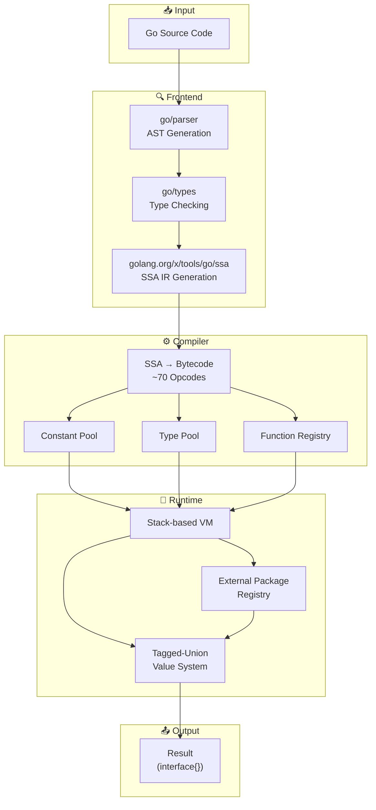
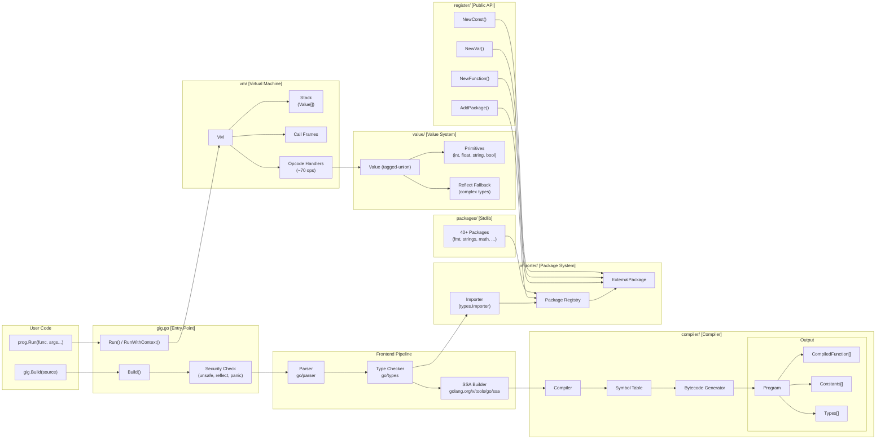
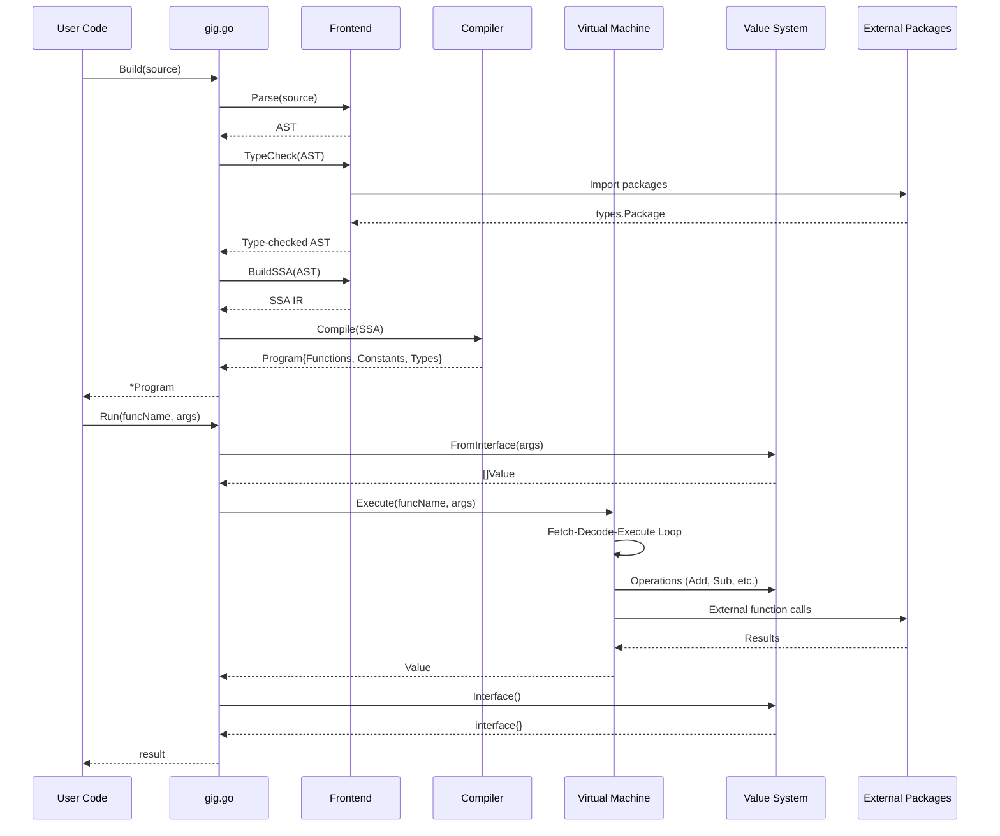
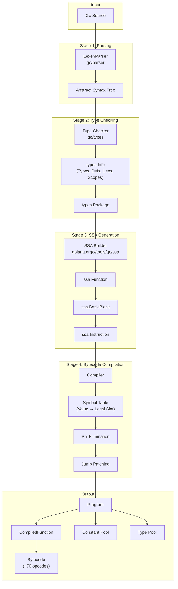
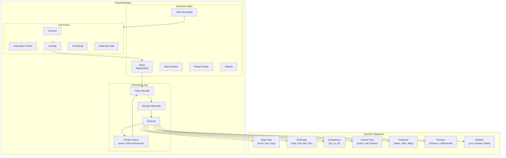
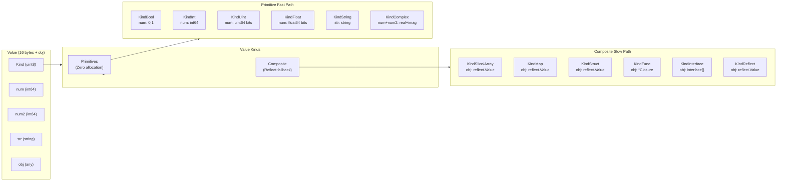
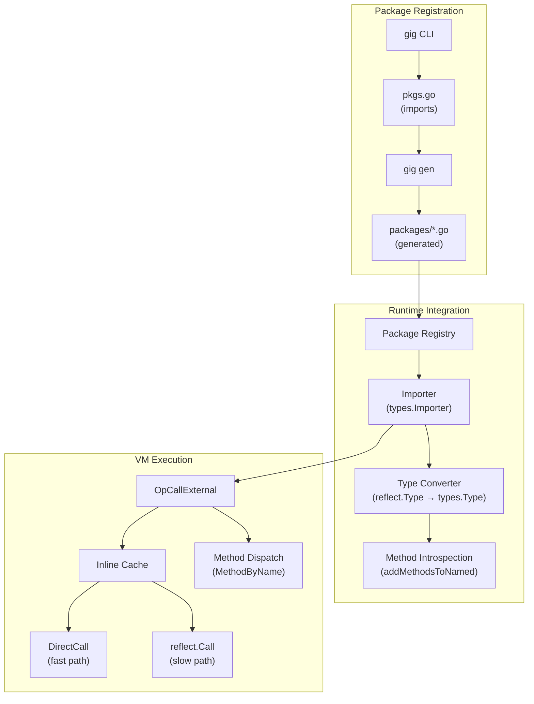

# Gig - Go Interpreter in Go

[](README_CN.md) [](README.md)

Gig is a high-performance Go interpreter written in Go, featuring SSA-to-bytecode compilation and a stack-based virtual machine.

> **Note**: This project was developed extensively using AI tools. It includes comprehensive tests (40+ test files) and benchmarks to ensure correctness and performance.

## Features

- **SSA-based compilation**: Uses `golang.org/x/tools/go/ssa` for intermediate representation
- **Stack-based VM**: Efficient bytecode execution with minimal overhead
- **Tagged-union Value system**: Zero reflection overhead for primitive types
- **Security**: Bans `unsafe`, `reflect`, and `panic` in interpreted code
- **Extensible**: Support for registering external Go packages (40+ stdlib packages built-in)
- **Context cancellation**: Full support for `context.Context` timeout and cancellation ([docs](docs/context-cancellation.md))

## Installation

```bash
go get github.com/t04dJ14n9/gig
```

## Quick Start

### Option 1: Use Built-in Standard Library (Recommended)

Gig comes with 40+ standard library packages pre-registered. Just import `gig/stdlib/packages`:

```go
package main

import (
    "fmt"
    _ "github.com/t04dJ14n9/gig/stdlib/packages" // Import gig's built-in stdlib
    "github.com/t04dJ14n9/gig"
)

func main() {
    source := `
package main

import "fmt"
import "strings"

func Greet(name string) string {
    return fmt.Sprintf("Hello, %s!", strings.ToUpper(name))
}
`

    prog, err := gig.Build(source)
    if err != nil {
        panic(err)
    }

    result, err := prog.Run("Greet", "world")
    if err != nil {
        panic(err)
    }

    fmt.Println(result) // Output: Hello, WORLD!
}
```

**Built-in packages include**: `fmt`, `strings`, `strconv`, `math`, `time`, `bytes`, `errors`, `sort`, `regexp`, `encoding/json`, `encoding/base64`, `net/url`, and 30+ more.

### Option 2: Use Custom Dependencies

If you need third-party libraries or a subset of standard library, use the `gig` CLI tool:

#### Step 1: Install the CLI

```bash
# Install the CLI tool
go install github.com/t04dJ14n9/gig/cmd/gig@latest

# Or run directly (Go 1.21+)
go run github.com/t04dJ14n9/gig/cmd/gig@latest --help
```

#### Step 2: Initialize a dependency package

```bash
# Create a dependency package named "mydep"
gig init -package mydep
```

This creates:

```
mydep/
└── pkgs.go    # Edit this to add/remove packages
```

#### Step 3: Customize dependencies

Edit `mydep/pkgs.go` to add third-party libraries:

```go
package mydep

import (
    // Standard library (keep what you need)
    _ "fmt"
    _ "strings"
    _ "time"

    // Third-party libraries
    _ "github.com/spf13/cast"
    _ "github.com/tidwall/gjson"
)
```

#### Step 4: Generate registration code

```bash
# Generate registration code from pkgs.go
gig gen ./mydep
```

This generates:

```
mydep/
├── pkgs.go
└── packages/
    ├── fmt.go
    ├── strings.go
    ├── github_com_spf13_cast.go
    └── github_com_tidwall_gjson.go
```

#### Step 5: Use in your program

```go
package main

import (
    "fmt"
    _ "myapp/mydep/packages" // Your custom dependency package
    "github.com/t04dJ14n9/gig"
)

func main() {
    source := `
package main

import "github.com/tidwall/gjson"

func GetJsonValue(json string, path string) string {
    return gjson.Get(json, path).String()
}
`

    prog, _ := gig.Build(source)
    result, _ := prog.Run("GetJsonValue", `{"name":"Alice"}`, "name")
    fmt.Println(result) // Output: Alice
}
```

## API Reference

### Building and Running

```go
// Build parses and compiles Go source code
prog, err := gig.Build(source string) (*Program, error)

// Run executes a function by name
result, err := prog.Run(funcName string, args ...interface{}) (interface{}, error)

// RunWithContext executes with context for cancellation (ctx is first parameter)
result, err := prog.RunWithContext(ctx context.Context, funcName string, args ...interface{}) (interface{}, error)
```

### Registering Packages (Advanced)

```go
import "github.com/t04dJ14n9/gig/importer"

// Register a package manually (usually done via generated code)
pkg := importer.RegisterPackage("mypkg", "mypkg")
pkg.AddFunction("MyFunc", MyFunc, "", directCall_MyFunc)
pkg.AddConstant("MyConst", MyConst, "")
pkg.AddVariable("MyVar", &MyVar, "")
pkg.AddType("MyType", reflect.TypeOf(MyType{}), "")
```

## Examples

See the `examples/` directory:

- **`examples/simple/`** - Using gig with built-in stdlib (easiest)
- **`examples/custom/`** - Using gig with custom dependencies

Run examples:

```bash
# Simple example (uses built-in stdlib)
cd gig/examples/simple
go run main.go

# Custom example
cd gig/examples/custom
go run main.go
```

## gig CLI Commands

```bash
# Initialize a dependency package
gig init -package <name>

# Generate registration code
gig gen <dir>

# Examples
gig init -package mydep         # Creates mydep/pkgs.go
gig gen ./mydep                 # Generates registration code in myapp/mydep/packages/
```

## Supported Features

- ✅ Arithmetic operations
- ✅ Variables and assignments
- ✅ Control flow (if/else, for loops, switch)
- ✅ Functions and recursion
- ✅ Multiple return values
- ✅ Closures
- ✅ String operations
- ✅ Slices and arrays
- ✅ Maps
- ✅ Structs and methods
- ✅ Interfaces
- ✅ Goroutines (basic)
- ✅ Context-based timeouts
- ✅ External Go function calls

## Performance

Real benchmarks comparing **Gig**, **Yaegi** (Go interpreter), **GopherLua** (Lua interpreter), and **native Go**, running on the same machine with identical algorithms.

> **Environment**: AMD EPYC 9754 128-Core, 32 threads, Linux amd64, Go 1.23.1  
> Benchmarks use `-count=5` with `benchstat` for statistical significance. Source: [`benchmarks/bench_test.go`](benchmarks/bench_test.go)

### Core Workloads (Gig vs Yaegi vs GopherLua vs Native Go)

| Workload                          | Native Go |         Gig |   Yaegi | GopherLua |        Gig vs Yaegi |
| --------------------------------- | --------: | ----------: | ------: | --------: | ------------------: |
| **Fibonacci(25)** recursive       |    449 μs | **20.1 ms** |  109 ms |    6.8 ms | **Gig 5.4x faster** |
| **ArithmeticSum(1K)** loop        |    333 ns | **35.4 μs** | 40.9 μs |     18 μs | **Gig 1.2x faster** |
| **BubbleSort(100)** nested loops  |    6.2 μs |  **927 μs** | 1.23 ms |    278 μs | **Gig 1.3x faster** |
| **Sieve(1000)** primes            |   1.88 μs |  **192 μs** |  205 μs |    172 μs | **Gig 1.1x faster** |
| **ClosureCalls(1K)** captured var |    661 ns |  **320 μs** |    1 ms |    156 μs | **Gig 3.1x faster** |

### External Function Calls (Gig vs Yaegi vs Native Go)

Calling Go standard library functions from interpreted code — the most common real-world pattern:

| Workload                           | Native Go |        Gig |    Yaegi |        Gig vs Yaegi |
| ---------------------------------- | --------: | ---------: | -------: | ------------------: |
| **DirectCall** (strings/strconv)   |   27.9 μs | **553 μs** | 1,551 μs | **Gig 2.8x faster** |
| **Reflect** (fmt/encoding)         |   24.1 μs | **356 μs** | 1,001 μs | **Gig 2.8x faster** |
| **Method** (Builder/Buffer/Regexp) |   18.4 μs | **450 μs** | 1,214 μs | **Gig 2.7x faster** |
| **Mixed** (functions + methods)    |   11.5 μs | **321 μs** |   846 μs | **Gig 2.6x faster** |

### Memory Efficiency

| Workload        | Gig allocs/op | Yaegi allocs/op |  Gig advantage |
| --------------- | ------------: | --------------: | -------------: |
| Fibonacci(25)   |         **7** |       2,138,703 | 305,529x fewer |
| BubbleSort(100) |         **9** |           5,085 |     565x fewer |
| Sieve(1000)     |         **7** |              43 |       6x fewer |
| ExtCallMethod   |     **6,906** |          13,916 |     2.0x fewer |
| ExtCallMixed    |     **4,258** |           9,125 |     2.1x fewer |

### Analysis

**Gig beats Yaegi on all 9 benchmarks**, with advantages ranging from 1.1x to 5.4x:

- **5.4x faster** on deep recursion (Fib25) — O(1) function lookup, frame pooling, and 7 allocs vs 2.1M
- **2.6–2.8x faster** on external calls — 1,162 generated DirectCall wrappers eliminate `reflect.Value.Call()` for 92% of stdlib functions and methods
- **1.1–1.3x faster** on tight loops (ArithSum, BubbleSort, Sieve) — integer-specialized `int64` locals and fused superinstructions
- **3.1x faster** on closures — efficient closure representation with shared `*value.Value` captures

**GopherLua vs Gig**: GopherLua is 2-4x faster on core workloads because Lua is a simpler, dynamically-typed language optimized for these patterns. However:

- **GopherLua requires manual function registration** — each Go function must be wrapped and registered individually; no direct package imports
- **No goroutines/channels** — Lua has coroutines, but they're not Go's CSP concurrency
- **No structs/interfaces/methods** — Lua uses tables, not Go's type system
- **Different syntax** — team must learn Lua; Gig uses familiar Go syntax

Key optimizations: SSA-to-bytecode compilation, 32-byte tagged-union values, superinstruction fusion (17 patterns), `intLocals []int64` specialization, `[]int64` slice fusion, DirectCall code generation, frame pooling, and inline caching.

**Why choose Gig over alternatives:**

|                              | Gig                            | Yaegi        | GopherLua           | Expr           |
| ---------------------------- | ------------------------------ | ------------ | ------------------- | -------------- |
| **Language**                 | Go                             | Go           | Lua                 | Expression DSL |
| **Full Go syntax**           | ✅                             | ✅           | ❌                  | ❌             |
| **Goroutines/Channels**      | ✅                             | ✅           | ❌                  | ❌             |
| **Security sandbox**         | ✅ (bans unsafe/reflect/panic) | ❌           | ❌                  | ✅             |
| **Struct/Interface/Methods** | ✅                             | ✅           | ❌                  | Limited        |
| **40+ stdlib packages**      | ✅                             | ✅           | Manual registration | N/A            |
| **Custom Go package import** | ✅ (code-gen)                  | ✅ (symbols) | Manual wrappers     | N/A            |
| **Context cancellation**     | ✅                             | ❌           | ❌                  | ❌             |
| **Embeddable**               | ✅                             | ✅           | ✅                  | ✅             |

**Reproduce these benchmarks:**

```bash
cd benchmarks
go test -bench=. -benchmem -count=5 -timeout=30m -run='^$'
```

## Security

Gig enforces security by banning certain imports:

- `unsafe` - Memory safety
- `reflect` - Type safety
- `panic` usage - Controlled execution

## Architecture

Gig uses a multi-stage compilation pipeline to transform Go source code into efficient bytecode, which is then executed by a stack-based virtual machine.

### High-Level Architecture



### Detailed Component Architecture



### Data Flow During Execution



### Compiler Pipeline Details



### Virtual Machine Architecture



### Value System Design



### External Package Integration



---

### Component Summary

| Component           | Package     | Purpose                                             |
| ------------------- | ----------- | --------------------------------------------------- |
| **Entry Point**     | `gig.go`    | Public API: `Build()`, `Run()`, `RunWithContext()`  |
| **Compiler**        | `compiler/` | SSA to bytecode compilation (~70 opcodes)           |
| **Virtual Machine** | `vm/`       | Stack-based bytecode execution                      |
| **Value System**    | `value/`    | Tagged-union values with zero-allocation primitives |
| **Importer**        | `importer/` | External package type resolution                    |
| **Register**        | `register/` | Public API for package registration                 |
| **Packages**        | `packages/` | 40+ pre-registered stdlib packages                  |
| **CLI**             | `cmd/gig`   | Code generation tool                                |

### Key Design Decisions

1. **SSA-based Compilation**: Uses Go's official SSA library for correct handling of complex control flow, closures, and method calls.

2. **Tagged-Union Values**: Primitive operations avoid reflection overhead by storing values in native Go types within a union.

3. **Inline Caching**: External function calls are cached with resolved function info for fast dispatch.

4. **Context Integration**: VM checks context cancellation every 1024 instructions for responsive timeout handling.

5. **Security by Default**: Bans `unsafe`, `reflect`, and `panic` in interpreted code for controlled execution.

## License

MIT License
