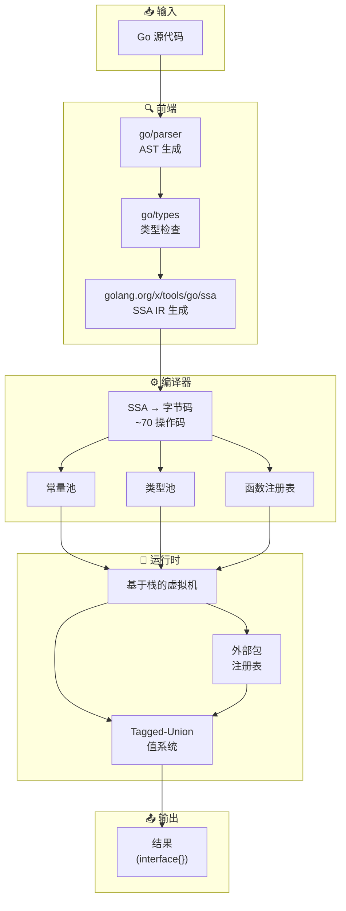
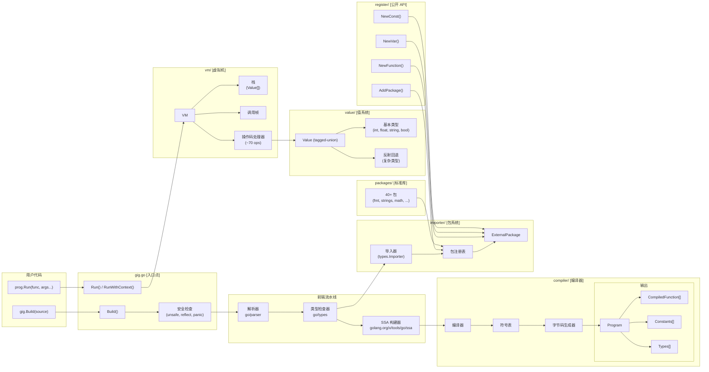
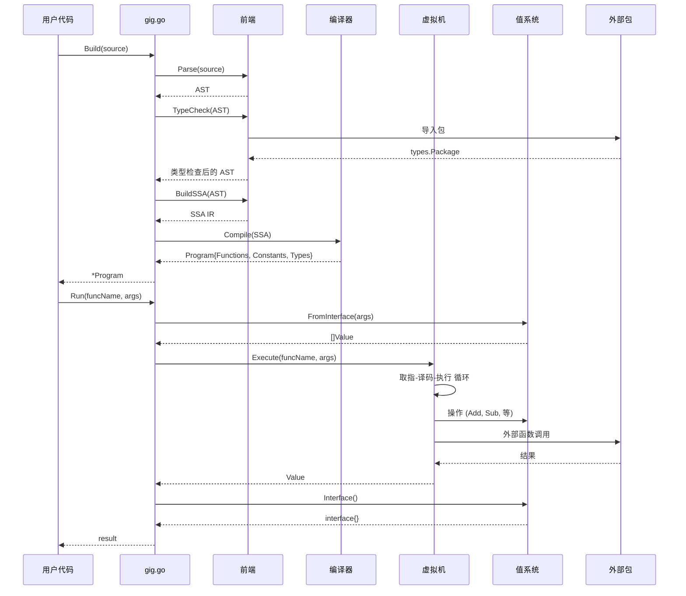
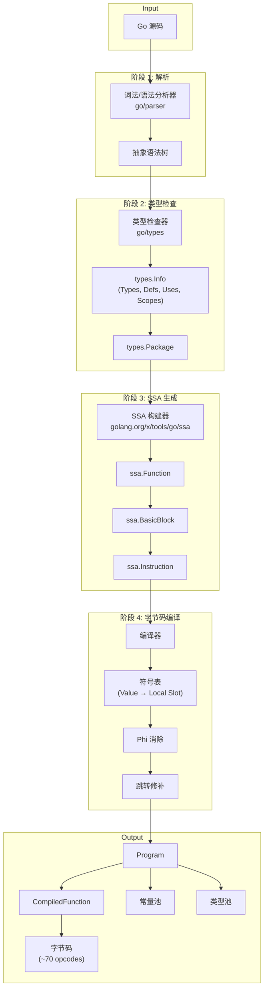
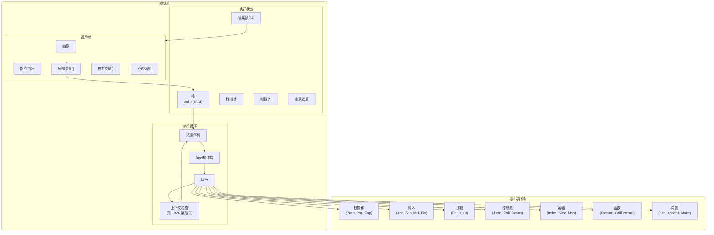
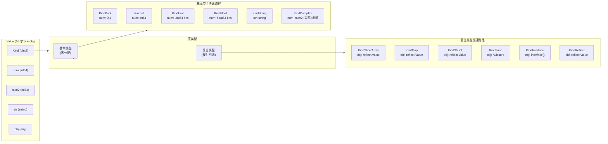
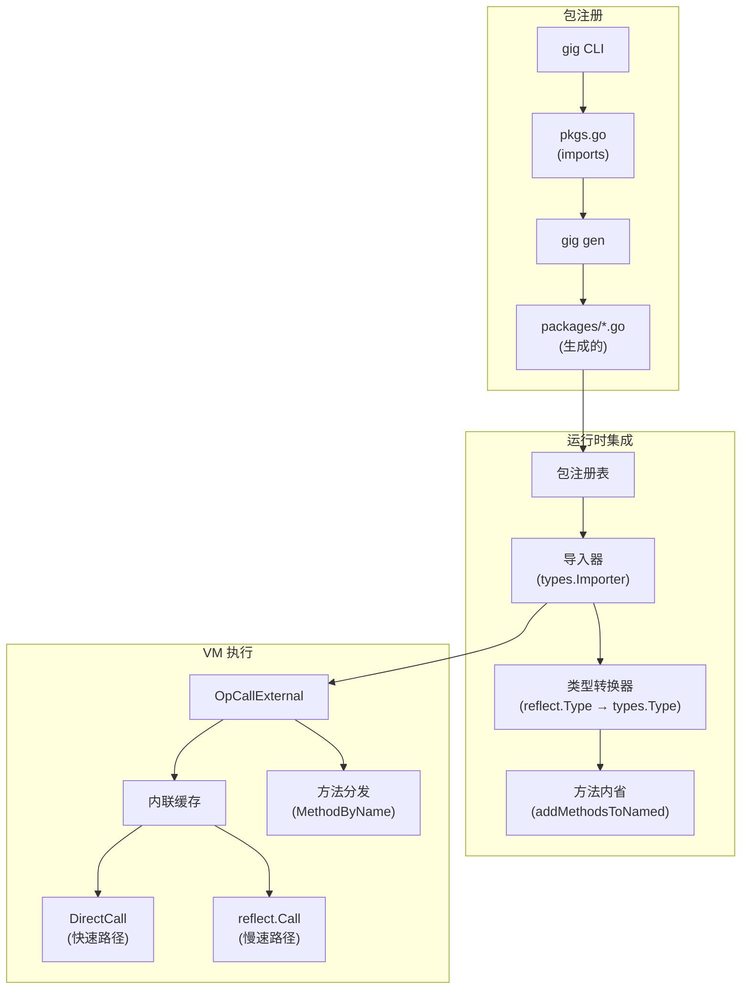

# Gig - Go 语言实现的Go 解释器

[](README_CN.md) [](README.md)

Gig 是一个用 Go 语言编写的高性能 Go 解释器，采用 SSA 到字节码的编译方式和基于栈的虚拟机。

> **说明**：本项目大量使用 AI 工具进行开发。它包含了全面的测试（40+ 测试文件）和基准测试，以确保正确性和性能。

## 特性

- **基于 SSA 的编译**：使用 `golang.org/x/tools/go/ssa` 作为中间表示
- **基于栈的虚拟机**：高效字节码执行，开销极小
- **Tagged-Union 值系统**：基本类型零反射开销
- **安全性**：在解释代码中禁止 `unsafe`、`reflect` 和 `panic`
- **可扩展**：支持注册外部 Go 包（内置 40+ 标准库包）
- **Context 取消支持**：完整支持 `context.Context` 超时和取消（[文档](docs/context-cancellation_CN.md)）

## 安装

```bash
go get git.woa.com/youngjin/gig
```

## 快速开始

### 方式一：使用内置标准库（推荐）

Gig 内置了 40+ 标准库包，只需导入 `gig/stdlib/packages`：

```go
package main

import (
    "fmt"
    _ "git.woa.com/youngjin/gig/stdlib/packages" // 导入 gig 的内置标准库
    "git.woa.com/youngjin/gig"
)

func main() {
    source := `
package main

import "fmt"
import "strings"

func Greet(name string) string {
    return fmt.Sprintf("Hello, %s!", strings.ToUpper(name))
}
`

    prog, err := gig.Build(source)
    if err != nil {
        panic(err)
    }

    result, err := prog.Run("Greet", "world")
    if err != nil {
        panic(err)
    }

    fmt.Println(result) // 输出: Hello, WORLD!
}
```

**内置包包括**：`fmt`、`strings`、`strconv`、`math`、`time`、`bytes`、`errors`、`sort`、`regexp`、`encoding/json`、`encoding/base64`、`net/url` 等 30 多个。

### 方式二：使用自定义依赖

如果需要第三方库或标准库子集，使用 `gig` CLI 工具：

#### 步骤 1：安装 CLI

```bash
# 安装 CLI 工具
go install git.woa.com/youngjin/gig/cmd/gig@latest

# 或直接运行（Go 1.21+）
go run git.woa.com/youngjin/gig/cmd/gig@latest --help
```

#### 步骤 2：初始化依赖包

```bash
# 创建名为 "mydep" 的依赖包
gig init -package mydep
```

这将创建：
```
mydep/
└── pkgs.go    # 编辑此文件以添加/移除包
```

#### 步骤 3：自定义依赖

编辑 `mydep/pkgs.go` 添加第三方库：

```go
package mydep

import (
    // 标准库（保留需要的）
    _ "fmt"
    _ "strings"
    _ "time"

    // 第三方库
    _ "github.com/spf13/cast"
    _ "github.com/tidwall/gjson"
)
```

#### 步骤 4：生成注册代码

```bash
# 从 pkgs.go 生成注册代码
gig gen ./mydep
```

这将生成：
```
mydep/
├── pkgs.go
└── packages/
    ├── fmt.go
    ├── strings.go
    ├── github_com_spf13_cast.go
    └── github_com_tidwall_gjson.go
```

#### 步骤 5：在程序中使用

```go
package main

import (
    "fmt"
    _ "myapp/mydep/packages" // 你的自定义依赖包
    "git.woa.com/youngjin/gig"
)

func main() {
    source := `
package main

import "github.com/tidwall/gjson"

func GetJsonValue(json string, path string) string {
    return gjson.Get(json, path).String()
}
`

    prog, _ := gig.Build(source)
    result, _ := prog.Run("GetJsonValue", `{"name":"Alice"}`, "name")
    fmt.Println(result) // 输出: Alice
}
```

## API 参考

### 构建和运行

```go
// Build 解析并编译 Go 源代码
prog, err := gig.Build(source string) (*Program, error)

// Run 按名称执行函数
result, err := prog.Run(funcName string, args ...interface{}) (interface{}, error)

// RunWithContext 带上下文执行，支持取消（ctx 是第一个参数）
result, err := prog.RunWithContext(ctx context.Context, funcName string, args ...interface{}) (interface{}, error)
```

### 注册包（高级）

```go
import "git.woa.com/youngjin/gig/register"

// 手动注册包（通常通过生成的代码完成）
pkg := register.RegisterPackage("mypkg", "mypkg")
pkg.AddFunction("MyFunc", MyFunc, "", directCall_MyFunc)
pkg.AddConstant("MyConst", MyConst, "")
pkg.AddVariable("MyVar", &MyVar, "")
pkg.AddType("MyType", reflect.TypeOf(MyType{}), "")
```

## 示例

参见 `examples/` 目录：

- **`examples/simple/`** - 使用内置标准库（最简单）
- **`examples/custom/`** - 使用自定义依赖

运行示例：

```bash
# 简单示例（使用内置标准库）
cd gig/examples/simple
go run main.go

# 自定义示例
cd gig/examples/custom
go run main.go
```

## gig CLI 命令

```bash
# 初始化依赖包
gig init -package <名称>

# 生成注册代码
gig gen <目录>

# 示例
gig init -package mydep         # 创建 mydep/pkgs.go
gig gen ./mydep                 # 在 myapp/mydep/packages/ 生成注册代码
```

## 支持的特性

- ✅ 算术运算
- ✅ 变量和赋值
- ✅ 控制流（if/else、for 循环、switch）
- ✅ 函数和递归
- ✅ 多返回值
- ✅ 闭包
- ✅ 字符串操作
- ✅ 切片和数组
- ✅ 映射（Map）
- ✅ 结构体和方法
- ✅ 接口
- ✅ Goroutine（基础支持）
- ✅ 基于上下文的超时控制
- ✅ 外部 Go 函数调用

## 性能

在同一台机器上使用相同算法，对比 **Gig**、**Yaegi**（Go 解释器）、**GopherLua**（Lua 解释器）和 **原生 Go** 的真实基准测试。

> **测试环境**：AMD EPYC 9754 128 核, 32 线程, Linux amd64, Go 1.23.1  
> 使用 `-count=5` 配合 `benchstat` 统计分析。源码：[`benchmarks/bench_test.go`](benchmarks/bench_test.go)

### 核心工作负载 (Gig vs Yaegi vs GopherLua vs 原生 Go)

| 工作负载 | 原生 Go | Gig | Yaegi | GopherLua | Gig vs Yaegi |
|---|---:|---:|---:|---:|---:|
| **Fibonacci(25)** 递归 | 449 μs | **20.1 ms** | 109 ms | 6.8 ms | **Gig 快 5.4 倍** |
| **ArithmeticSum(1K)** 循环 | 333 ns | **35.4 μs** | 40.9 μs | 18 μs | **Gig 快 1.2 倍** |
| **BubbleSort(100)** 嵌套循环 | 6.2 μs | **927 μs** | 1.23 ms | 278 μs | **Gig 快 1.3 倍** |
| **Sieve(1000)** 质数筛 | 1.88 μs | **192 μs** | 205 μs | 172 μs | **Gig 快 1.1 倍** |
| **ClosureCalls(1K)** 闭包调用 | 661 ns | **320 μs** | 1 ms | 156 μs | **Gig 快 3.1 倍** |

### 外部函数调用 (Gig vs Yaegi vs 原生 Go)

从解释代码调用 Go 标准库函数 —— 最常见的实际使用场景：

| 工作负载 | 原生 Go | Gig | Yaegi | Gig vs Yaegi |
|---|---:|---:|---:|---:|
| **DirectCall** (strings/strconv) | 27.9 μs | **553 μs** | 1,551 μs | **Gig 快 2.8 倍** |
| **Reflect** (fmt/encoding) | 24.1 μs | **356 μs** | 1,001 μs | **Gig 快 2.8 倍** |
| **Method** (Builder/Buffer/Regexp) | 18.4 μs | **450 μs** | 1,214 μs | **Gig 快 2.7 倍** |
| **Mixed** (函数 + 方法) | 11.5 μs | **321 μs** | 846 μs | **Gig 快 2.6 倍** |

### 内存效率

| 工作负载 | Gig 分配次数/op | Yaegi 分配次数/op | Gig 优势 |
|---|---:|---:|---:|
| Fibonacci(25) | **7** | 2,138,703 | 少 305,529 倍 |
| BubbleSort(100) | **9** | 5,085 | 少 565 倍 |
| Sieve(1000) | **7** | 43 | 少 6 倍 |
| ExtCallMethod | **6,906** | 13,916 | 少 2.0 倍 |
| ExtCallMixed | **4,258** | 9,125 | 少 2.1 倍 |

### 分析

**Gig 在全部 9 项基准测试中均优于 Yaegi**，优势从 1.1 倍到 5.4 倍：

- **递归快 5.4 倍**（Fib25）—— O(1) 函数查找、帧池化，仅 7 次分配 vs 210 万次
- **外部调用快 2.6–2.8 倍** —— 1,162 个生成的 DirectCall 包装器消除了 92% 标准库函数和方法的 `reflect.Value.Call()`
- **紧凑循环快 1.1–1.3 倍**（ArithSum、BubbleSort、Sieve）—— 整数特化 `int64` 局部变量和融合超级指令
- **闭包快 3.1 倍** —— 高效的闭包表示，通过共享 `*value.Value` 捕获变量

**GopherLua vs Gig**：GopherLua 在核心工作负载上快 2-4 倍，因为 Lua 是更简单的动态类型语言，针对这些模式进行了优化。但是：

- **GopherLua 需要手动注册函数** —— 每个 Go 函数都需要单独包装和注册；无法直接导入包
- **没有 Goroutine/Channel** —— Lua 有协程，但不是 Go 的 CSP 并发模型
- **没有结构体/接口/方法** —— Lua 使用表（table），不是 Go 的类型系统
- **不同的语法** —— 团队需要学习 Lua；Gig 使用熟悉的 Go 语法

关键优化：SSA 到字节码编译、32 字节 tagged-union 值、超级指令融合（17 种模式）、`intLocals []int64` 特化、`[]int64` 切片融合、DirectCall 代码生成、帧池化和内联缓存。

**为什么选择 Gig：**

| | Gig | Yaegi | GopherLua | Expr |
|---|---|---|---|---|
| **语言** | Go | Go | Lua | 表达式 DSL |
| **完整 Go 语法** | ✅ | ✅ | ❌ | ❌ |
| **Goroutine/Channel** | ✅ | ✅ | ❌ | ❌ |
| **安全沙箱** | ✅（禁止 unsafe/reflect/panic） | ❌ | ❌ | ✅ |
| **结构体/接口/方法** | ✅ | ✅ | ❌ | 有限 |
| **40+ 标准库包** | ✅ | ✅ | 需手动注册 | N/A |
| **自定义 Go 包导入** | ✅（代码生成） | ✅（符号表） | 需手动包装 | N/A |
| **Context 取消** | ✅ | ❌ | ❌ | ❌ |
| **可嵌入** | ✅ | ✅ | ✅ | ✅ |

**复现这些基准测试：**
```bash
cd benchmarks
go test -bench=. -benchmem -count=5 -timeout=30m -run='^$'
```

## 安全性

Gig 通过禁止某些导入来强制安全性：
- `unsafe` - 内存安全
- `reflect` - 类型安全
- `panic` 使用 - 受控执行

## 架构

Gig 使用多阶段编译流水线将 Go 源代码转换为高效字节码，然后由基于栈的虚拟机执行。

### 高层架构



### 详细组件架构



### 执行时数据流



### 编译流水线详情



### 虚拟机架构



### 值系统设计



### 外部包集成



---

### 组件概览

| 组件 | 包 | 用途 |
|------|-----|------|
| **入口点** | `gig.go` | 公开 API：`Build()`、`Run()`、`RunWithContext()` |
| **编译器** | `compiler/` | SSA 到字节码编译（~70 操作码） |
| **虚拟机** | `vm/` | 基于栈的字节码执行 |
| **值系统** | `value/` | Tagged-union 值，基本类型零分配 |
| **导入器** | `importer/` | 外部包类型解析 |
| **注册器** | `register/` | 包注册公开 API |
| **标准库包** | `packages/` | 40+ 预注册标准库包 |
| **CLI** | `cmd/gig` | 代码生成工具 |

### 关键设计决策

1. **基于 SSA 的编译**：使用 Go 官方 SSA 库，正确处理复杂控制流、闭包和方法调用。

2. **Tagged-Union 值**：基本类型操作避免反射开销，将值存储在联合体中的原生 Go 类型中。

3. **内联缓存**：外部函数调用缓存已解析的函数信息，实现快速分发。

4. **上下文集成**：虚拟机每 1024 条指令检查一次上下文取消，实现响应式超时处理。

5. **默认安全**：在解释代码中禁止 `unsafe`、`reflect` 和 `panic`，实现受控执行。

## 更新日志

### v0.2.0 - 外部类型方法支持

**修复**：现在完全支持外部（已注册）类型上的方法。

此前，调用外部类型的方法如 `gjson.Get(json, path).String()` 会因类型检查错误而失败，因为方法未在 `types.Named` 类型上注册。此问题已在三个层面修复：

- **`importer/importer.go`**：添加了 `addMethodsToNamed()` —— 在将 `reflect.Type` 转换为 `types.Named` 时，枚举所有导出方法（值接收者和指针接收者）并通过 `named.AddMethod()` 添加。这使 Go 类型检查器能够解析外部类型上的方法调用。

- **`compiler/compiler.go`**：添加了 `ExternalMethodInfo` 并更新 `compileExternalStaticCall` 以检测方法调用（`sig.Recv() != nil`）并使用方法分发元数据发出，而不是查找静态函数对象。

- **`vm/vm.go`**：添加了 `callExternalMethod()`，通过 `reflect.Value.MethodByName()` 分发外部类型上的方法调用，处理可变参数、指针接收者和多返回值。

## 许可证

MIT License
