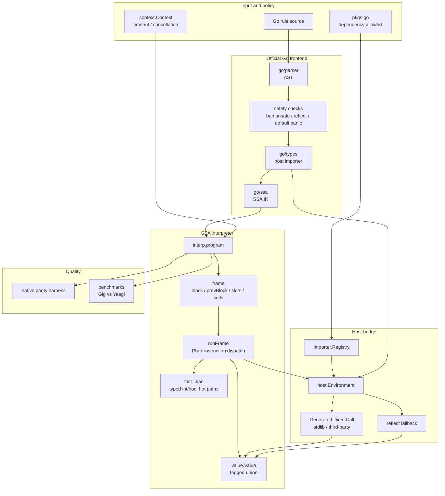

# Gig - Go Rule Interpreter

[](README_CN.md) [](README.md)

Gig is an embeddable Go rule interpreter. It reuses the official Go parser,
type checker, and `golang.org/x/tools/go/ssa` frontend, then executes SSA
directly with a lightweight frame-based interpreter. External Go packages are
exposed through an explicit host registry, and `gig gen` can generate DirectCall
wrappers for standard-library and third-party functions to avoid the high cost
of `reflect.Value.Call` on hot external-call paths.

The project is intended for systems where business rules change faster than
normal code releases: campaign rules, configurable conditions, scripted
decisions, and controlled access to existing Go services or libraries.

> Note: This project was developed extensively with AI assistance. It includes
> native-parity tests and benchmarks to keep the interpreter aligned with Go
> semantics and performance goals.

More details:

- [Chinese project overview and architecture notes](docs/GIG_RULE_ENGINE_OVERVIEW_CN.md)
- [Architecture walkthrough](docs/ARCHITECTURE.md)
- [Chinese architecture walkthrough](docs/ARCHITECTURE_CN.md)
- [Performance optimization log](docs/PERFORMANCE_OPTIMIZATION_2026-06_CN.md)

## Features

- **Go syntax for rules**: write rules as normal Go functions with control flow,
  functions, recursion, closures, multiple return values, structs, methods,
  interfaces, defer/panic/recover, goroutines, channels, and select.
- **Direct SSA interpretation**: source goes through parse, type check, and SSA
  generation, then `internal/interp` walks `ssa.Function`, `ssa.BasicBlock`, and
  `ssa.Instruction` directly. There is no custom bytecode VM in the current
  runtime.
- **Frame-based execution model**: each interpreted call has a frame containing
  the current block, previous block, SSA value slots, fallback cells, free
  variables, iterators, and defer/panic state.
- **Typed value system**: `value.Value` stores primitive values in a compact
  tagged-union representation and falls back to reflection only for host or
  composite values that need it.
- **Generated external-call bridge**: `gig gen` creates package registration code
  and DirectCall wrappers for standard-library and third-party package
  functions.
- **Controlled host boundary**: scripts can only import registered packages.
  The frontend rejects `unsafe` and `reflect`, rejects `panic` by default, and
  prevents interpreted structs from silently satisfying host non-empty
  interfaces.
- **Context cancellation**: `RunWithContext` supports timeout and cancellation.
- **Native-parity harness**: tests compare interpreted results with native Go
  execution for complex syntax, closures, external calls, panic/recover, and
  other edge cases.

## Installation

```bash
go get github.com/t04dJ14n9/gig
```

## Quick Start

### Use Built-In Standard Library Packages

Gig ships with generated registrations for common standard-library packages.
Import `gig/stdlib/packages` for side effects:

```go
package main

import (
    "fmt"

    "github.com/t04dJ14n9/gig"
    _ "github.com/t04dJ14n9/gig/stdlib/packages"
)

func main() {
    source := `
package main

import "fmt"
import "strings"

func Greet(name string) string {
    return fmt.Sprintf("Hello, %s!", strings.ToUpper(name))
}
`

    prog, err := gig.Build(source)
    if err != nil {
        panic(err)
    }

    result, err := prog.Run("Greet", "world")
    if err != nil {
        panic(err)
    }

    fmt.Println(result) // Hello, WORLD!
}
```

Built-in packages include `fmt`, `strings`, `strconv`, `math`, `time`, `bytes`,
`errors`, `sort`, `regexp`, `encoding/json`, `encoding/base64`, `net/url`, and
many more.

### Use Custom Dependencies

Use the `gig` CLI when you need third-party packages or a smaller dependency
surface.

Install the CLI:

```bash
go install github.com/t04dJ14n9/gig/cmd/gig@latest
```

Initialize a dependency package:

```bash
gig init -package mydep
```

Edit `mydep/pkgs.go`:

```go
package mydep

import (
    _ "fmt"
    _ "strings"

    _ "github.com/spf13/cast"
    _ "github.com/tidwall/gjson"
)
```

Generate registrations and DirectCall wrappers:

```bash
gig gen ./mydep
```

Use the generated package:

```go
package main

import (
    "fmt"

    "github.com/t04dJ14n9/gig"
    _ "myapp/mydep/packages"
)

func main() {
    source := `
package main

import "github.com/tidwall/gjson"

func GetJSONValue(json string, path string) string {
    return gjson.Get(json, path).String()
}
`

    prog, err := gig.Build(source)
    if err != nil {
        panic(err)
    }
    result, err := prog.Run("GetJSONValue", `{"name":"Alice"}`, "name")
    if err != nil {
        panic(err)
    }
    fmt.Println(result) // Alice
}
```

## API Reference

### Build and Run

```go
// Build parses, type-checks, builds SSA, and prepares the interpreter program.
prog, err := gig.Build(source string, opts ...gig.BuildOption)

// Run executes a function by name using the default timeout.
result, err := prog.Run(funcName string, args ...any)

// RunWithContext executes with caller-provided cancellation.
result, err := prog.RunWithContext(ctx context.Context, funcName string, args ...any)
```

### Build Options

```go
// Use a custom registry instead of the global package registry.
gig.WithRegistry(registry)

// Allow panic/recover/defer semantics. By default, panic is rejected at build time.
gig.WithAllowPanic()
```

### Manual Package Registration

Generated packages are preferred, but packages can also be registered manually:

```go
import "github.com/t04dJ14n9/gig/importer"

pkg := importer.RegisterPackage("mypkg", "mypkg")
pkg.AddFunction("MyFunc", MyFunc, "", directCallMyFunc) // DirectCall is optional.
pkg.AddConstant("MyConst", MyConst, "")
pkg.AddVariable("MyVar", &MyVar, "")
pkg.AddType("MyType", reflect.TypeOf(MyType{}), "")
```

The current DirectCall function signature is:

```go
func([]value.Value) ([]value.Value, error)
```

## Examples

- [`examples/simple`](examples/simple) uses the built-in standard-library
  registrations.
- [`examples/custom`](examples/custom) shows custom generated dependencies,
  including third-party packages.

Run them:

```bash
cd examples/simple && go run main.go
cd ../custom && go run main.go
```

## CLI

```bash
# Initialize a dependency package.
gig init -package mydep

# Generate package registrations and DirectCall wrappers.
gig gen ./mydep

# Inspect CLI help.
gig --help
```

## Architecture

Gig currently uses a direct SSA interpreter. The old bytecode compiler and
stack-based VM have been removed from the active runtime.



Main components:

| Component | Package / file | Responsibility |
| --- | --- | --- |
| Public API | `gig.go` | `Build`, `Run`, `RunWithContext`, and `any` / `value.Value` conversion |
| Frontend | `internal/frontend` | parse, type check, auto import, security checks, SSA build |
| Interpreter | `internal/interp` | frame setup, SSA dispatch, defer/panic/recover, goroutines, channels, select |
| Fast paths | `internal/interp/fast_plan.go` | typed int/bool Phi, BinOp, If, full fast blocks, IndexAddr fusion |
| Value system | `value` | tagged-union values, typed zero/convert, interface boxes, reflect fallback |
| Host bridge | `host`, `importer` | external functions, variables, constants, types, methods, DirectFunction/DirectMethod |
| Code generation | `cmd/gig/gentool` | generated package registrations and DirectCall wrappers |
| Built-in packages | `stdlib/packages` | pre-generated standard-library package registrations |
| Tests / benchmarks | `tests`, `benchmarks` | native parity tests and Gig vs Yaegi comparisons |

## Performance

The latest detailed benchmark notes are in
[`docs/PERFORMANCE_OPTIMIZATION_2026-06_CN.md`](docs/PERFORMANCE_OPTIMIZATION_2026-06_CN.md).
The short version: external function, method, and mixed-call workloads are faster
than Yaegi in the current benchmark suite; pure arithmetic micro-loops remain an
area for further work.

Recent 5-run averages:

| Workload | Gig | Yaegi | Result |
| --- | ---: | ---: | --- |
| Fib25 | 57.88 ms | 53.74 ms | Yaegi 1.08x faster |
| ArithSum | 40.0 us | 23.8 us | Yaegi 1.68x faster |
| BubbleSort | 644.0 us | 676.9 us | Gig 1.05x faster |
| Sieve | 161.5 us | 114.6 us | Yaegi 1.41x faster |
| ClosureCalls | 445.6 us | 446.7 us | roughly equal |
| ExtCallDirectCall | 673.6 us | 754.3 us | Gig 1.12x faster |
| ExtCallReflect | 372.2 us | 444.7 us | Gig 1.19x faster |
| ExtCallMethod | 407.9 us | 558.6 us | Gig 1.37x faster |
| ExtCallMixed | 327.8 us | 386.1 us | Gig 1.18x faster |

DirectCall wrapper comparison against a no-DirectCall build:

| Workload | DirectCall enabled | DirectCall disabled | Speedup |
| --- | ---: | ---: | ---: |
| ExtCallDirectCall | 697.3 us | 1307.1 us | 1.87x |
| ExtCallReflect | 380.4 us | 8577.8 us | 22.55x |
| ExtCallMethod | 415.1 us | 8160.0 us | 19.66x |
| ExtCallMixed | 335.7 us | 4476.5 us | 13.34x |

Reproduce benchmarks:

```bash
cd benchmarks
go test -bench '^Benchmark(Gig|Yaegi)_' -benchmem -count=5 -run '^$'
```

## Security Model

Gig is not an unrestricted Go runtime. The default safety model is based on
explicit host capability registration:

- external packages must be registered through the package registry;
- `unsafe` and `reflect` imports are rejected;
- `panic` is rejected by default and can be enabled with `WithAllowPanic`;
- execution supports `context.Context` cancellation;
- interpreted structs are not allowed to silently satisfy host non-empty
  interfaces without an explicit proxy.

## Testing

Common verification commands:

```bash
go test ./...
(cd cmd/gig && go test ./...)
(cd examples/custom && go test ./...)
```

The main test suite includes correctness tests, native-parity tests, external
package tests, method/value tests, panic/recover behavior, and interpreter hot
path tests.

## Why Gig?

| Capability | Gig | Yaegi | GopherLua | Expr |
| --- | --- | --- | --- | --- |
| Rule language | Go | Go | Lua | expression DSL |
| Full Go-like functions | yes | yes | no | no |
| Go type checker / SSA frontend | yes | no | no | no |
| Controlled host capabilities | yes | partial | manual wrappers | yes |
| Generated third-party bindings | yes | symbols | manual wrappers | N/A |
| DirectCall external fast path | yes | no | manual | N/A |
| Context cancellation | yes | no | no | no |
| Embeddable in Go services | yes | yes | yes | yes |

Gig is a pragmatic fit when teams want rules to look like Go, need explicit
control over which external capabilities are exposed, and want automated parity
tests against native Go behavior.
