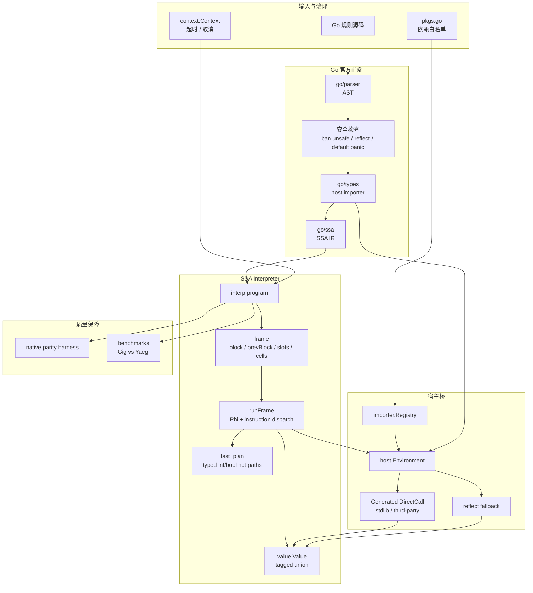

# Gig - Go 语言规则解释执行引擎

[](README_CN.md) [](README.md)

Gig 是一个可嵌入 Go 应用的规则解释执行引擎。它复用 Go 官方
`go/parser`、`go/types` 和 `golang.org/x/tools/go/ssa` 前端生成 SSA，
再通过轻量的函数调用帧解释器直接执行规则代码。外部 Go 包通过显式
host registry 暴露给脚本，`gig gen` 可为标准库和第三方库生成
DirectCall wrapper，降低外部函数调用落到 `reflect.Value.Call` 的成本。

这个项目面向规则变化快、硬编码发布慢、模板函数扩展成本高的业务系统：
让规则仍然用 Go 语法表达，让宿主系统能够治理依赖、超时、安全边界和
上线流程。

> 说明：本项目大量使用 AI 工具进行开发。仓库中包含解释执行与原生 Go
> 执行结果对比的测试，以及性能基准，用于持续校验语义一致性和性能变化。

更多材料：

- [当前架构与创新点总览](docs/GIG_RULE_ENGINE_OVERVIEW_CN.md)
- [内部实现走读](docs/ARCHITECTURE_CN.md)
- [英文架构说明](docs/ARCHITECTURE.md)
- [性能优化记录](docs/PERFORMANCE_OPTIMIZATION_2026-06_CN.md)

## 特性

- **Go 语法规则**：业务规则可以写成普通 Go 函数，支持控制流、函数、递归、闭包、多返回值、结构体、方法、接口、defer/panic/recover、goroutine、channel 和 select 等常用语义。
- **直接 SSA 解释执行**：源码经过 parse、type check 和 SSA 生成后，由 `internal/interp` 直接执行 `ssa.Function`、`ssa.BasicBlock` 和 `ssa.Instruction`。
- **函数调用帧模型**：每次解释执行函数调用都有独立 frame，保存当前 basic block、上一跳转来源、SSA value slot、fallback cell、free variables、iterator 和 defer/panic 状态。
- **Typed Value 系统**：`value.Value` 使用紧凑 tagged-union 表示，基础类型尽量保存在内联字段中，复合值和宿主对象才进入 reflect fallback。
- **生成式外部调用桥**：`gig gen` 为标准库和第三方包生成注册代码与 DirectCall wrapper，解释器调用外部函数时优先绕过 `reflect.Value.Call`。
- **可治理宿主边界**：脚本只能导入已注册包；前端拒绝 `unsafe` 和 `reflect`，默认拒绝 `panic`，并阻止解释期 struct 未经显式 proxy 冒充宿主非空 interface。
- **Context 取消支持**：`RunWithContext` 支持超时和取消。
- **原生对照测试 harness**：测试体系自动对比解释执行结果与原生 Go 执行结果，覆盖复杂语法、闭包、外部函数、panic/recover 等场景。

## 安装

```bash
go get github.com/t04dJ14n9/gig
```

## 快速开始

### 使用内置标准库

Gig 内置了常用标准库包的生成注册文件。使用时导入
`github.com/t04dJ14n9/gig/stdlib/packages` 即可：

```go
package main

import (
    "fmt"

    "github.com/t04dJ14n9/gig"
    _ "github.com/t04dJ14n9/gig/stdlib/packages"
)

func main() {
    source := `
package main

import "fmt"
import "strings"

func Greet(name string) string {
    return fmt.Sprintf("Hello, %s!", strings.ToUpper(name))
}
`

    prog, err := gig.Build(source)
    if err != nil {
        panic(err)
    }

    result, err := prog.Run("Greet", "world")
    if err != nil {
        panic(err)
    }

    fmt.Println(result) // Hello, WORLD!
}
```

内置包包括 `fmt`、`strings`、`strconv`、`math`、`time`、`bytes`、
`errors`、`sort`、`regexp`、`encoding/json`、`encoding/base64`、
`net/url` 等。

### 使用自定义依赖

如果需要第三方库或只暴露部分标准库，请使用 `gig` CLI 生成依赖注册包。

安装 CLI：

```bash
go install github.com/t04dJ14n9/gig/cmd/gig@latest
```

初始化依赖包：

```bash
gig init -package mydep
```

编辑 `mydep/pkgs.go`：

```go
package mydep

import (
    _ "fmt"
    _ "strings"

    _ "github.com/spf13/cast"
    _ "github.com/tidwall/gjson"
)
```

生成注册代码和 DirectCall wrapper：

```bash
gig gen ./mydep
```

在宿主程序中使用生成包：

```go
package main

import (
    "fmt"

    "github.com/t04dJ14n9/gig"
    _ "myapp/mydep/packages"
)

func main() {
    source := `
package main

import "github.com/tidwall/gjson"

func GetJSONValue(json string, path string) string {
    return gjson.Get(json, path).String()
}
`

    prog, err := gig.Build(source)
    if err != nil {
        panic(err)
    }
    result, err := prog.Run("GetJSONValue", `{"name":"Alice"}`, "name")
    if err != nil {
        panic(err)
    }
    fmt.Println(result) // Alice
}
```

## API 参考

### 构建和运行

```go
// Build 解析源码、类型检查、生成 SSA，并创建可执行 Program。
prog, err := gig.Build(source string, opts ...gig.BuildOption)

// Run 使用默认超时按函数名执行。
result, err := prog.Run(funcName string, args ...any)

// RunWithContext 使用调用方提供的 context 执行，支持取消。
result, err := prog.RunWithContext(ctx context.Context, funcName string, args ...any)
```

### 构建选项

```go
// 使用自定义 registry，而不是全局包注册表。
gig.WithRegistry(registry)

// 允许 panic/recover/defer 语义。默认情况下 panic 会在构建阶段被拒绝。
gig.WithAllowPanic()
```

### 手动注册包

推荐使用 `gig gen` 生成注册文件。需要手动注册时可以这样做：

```go
import "github.com/t04dJ14n9/gig/importer"

pkg := importer.RegisterPackage("mypkg", "mypkg")
pkg.AddFunction("MyFunc", MyFunc, "", directCallMyFunc) // DirectCall 可选
pkg.AddConstant("MyConst", MyConst, "")
pkg.AddVariable("MyVar", &MyVar, "")
pkg.AddType("MyType", reflect.TypeOf(MyType{}), "")
```

当前 DirectCall 函数签名：

```go
func([]value.Value) ([]value.Value, error)
```

## 示例

- [`examples/simple`](examples/simple)：使用内置标准库注册文件。
- [`examples/custom`](examples/custom)：使用自定义生成依赖，包含第三方包示例。

运行示例：

```bash
cd examples/simple && go run main.go
cd ../custom && go run main.go
```

## CLI

```bash
# 初始化依赖包
gig init -package mydep

# 生成包注册文件和 DirectCall wrapper
gig gen ./mydep

# 查看 CLI 帮助
gig --help
```

## 当前架构



### 组件概览

| 组件 | 包 / 文件 | 职责 |
| --- | --- | --- |
| 入口 API | `gig.go` | `Build`、`Run`、`RunWithContext`，以及 `any` / `value.Value` 转换 |
| 前端 | `internal/frontend` | parse、类型检查、自动导入、安全检查、SSA 构建 |
| 解释器 | `internal/interp` | frame 初始化、SSA dispatch、defer/panic/recover、goroutine、channel、select |
| 热路径 | `internal/interp/fast_plan.go` | plain `int`/`bool` Phi、BinOp、If、fast block、IndexAddr fusion |
| 值系统 | `value` | tagged-union value、typed zero/convert、interface box、reflect fallback |
| 宿主桥 | `host`、`importer` | 外部函数、变量、常量、类型、方法、DirectFunction / DirectMethod |
| 代码生成 | `cmd/gig/gentool` | 生成包注册文件和 DirectCall wrapper |
| 内置包 | `stdlib/packages` | 预生成的标准库包注册文件 |
| 测试与基准 | `tests`、`benchmarks` | 原生对照测试和 Gig vs Yaegi benchmark |

## 性能

详细数据见 [性能优化记录](docs/PERFORMANCE_OPTIMIZATION_2026-06_CN.md)。
当前 benchmark 的简要结论是：外部函数、方法和混合调用场景快于 Yaegi；
纯算术微循环仍是后续优化重点。

近期 5 轮 benchmark 平均值：

| Workload | Gig | Yaegi | 结果 |
| --- | ---: | ---: | --- |
| Fib25 | 57.88 ms | 53.74 ms | Yaegi 快 1.08x |
| ArithSum | 40.0 us | 23.8 us | Yaegi 快 1.68x |
| BubbleSort | 644.0 us | 676.9 us | Gig 快 1.05x |
| Sieve | 161.5 us | 114.6 us | Yaegi 快 1.41x |
| ClosureCalls | 445.6 us | 446.7 us | 基本持平 |
| ExtCallDirectCall | 673.6 us | 754.3 us | Gig 快 1.12x |
| ExtCallReflect | 372.2 us | 444.7 us | Gig 快 1.19x |
| ExtCallMethod | 407.9 us | 558.6 us | Gig 快 1.37x |
| ExtCallMixed | 327.8 us | 386.1 us | Gig 快 1.18x |

DirectCall 开关对比：

| Workload | 开启 DirectCall | 禁用 DirectCall | 提升 |
| --- | ---: | ---: | ---: |
| ExtCallDirectCall | 697.3 us | 1307.1 us | 1.87x |
| ExtCallReflect | 380.4 us | 8577.8 us | 22.55x |
| ExtCallMethod | 415.1 us | 8160.0 us | 19.66x |
| ExtCallMixed | 335.7 us | 4476.5 us | 13.34x |

复现 benchmark：

```bash
cd benchmarks
go test -bench '^Benchmark(Gig|Yaegi)_' -benchmem -count=5 -run '^$'
```

## 安全模型

Gig 不是无限制 Go runtime。默认安全模型基于显式 host capability 注册：

- 外部包必须通过 registry 注册；
- 拒绝导入 `unsafe` 和 `reflect`；
- 默认拒绝 `panic`，可通过 `WithAllowPanic` 开启；
- 执行支持 `context.Context` 取消；
- 解释期 struct 不能未经显式 proxy 直接满足宿主非空 interface。

## 测试

常用验证命令：

```bash
go test ./...
(cd cmd/gig && go test ./...)
(cd examples/custom && go test ./...)
```

测试覆盖包括：基础正确性、原生 Go 对照、外部包调用、方法和值类型、
panic/recover、并发相关语义，以及解释器热点路径。

## 为什么选择 Gig

| 能力 | Gig | Yaegi | GopherLua | Expr |
| --- | --- | --- | --- | --- |
| 规则语言 | Go | Go | Lua | 表达式 DSL |
| Go 风格函数组织 | 支持 | 支持 | 不支持 | 不支持 |
| Go type checker / SSA 前端 | 支持 | 不使用 | 不支持 | 不支持 |
| 受控宿主能力边界 | 支持 | 部分支持 | 需手写 wrapper | 支持 |
| 第三方 Go 包绑定生成 | 支持 | symbols | 需手写 wrapper | N/A |
| DirectCall 外部调用快路径 | 支持 | 不支持 | 手写 | N/A |
| Context 取消 | 支持 | 不支持 | 不支持 | 不支持 |
| 可嵌入 Go 服务 | 支持 | 支持 | 支持 | 支持 |

Gig 适合需要“规则像 Go 一样写”、又需要明确控制外部能力边界和上线回归的
Go 服务。
