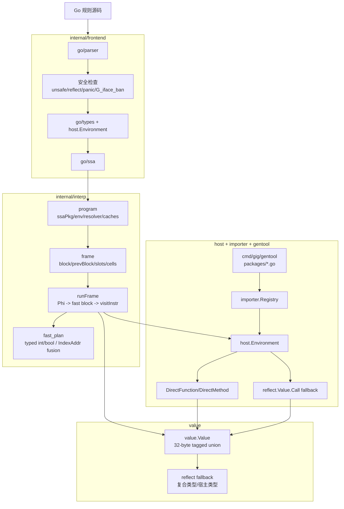

# Gig 架构设计

Gig 把 Go 代码嵌进 Go 应用：你把源码作为字符串传入，得到一个 `*Program`，
再调用 Program 上导出的函数。表面是单一字符串接口，背后是四阶段流水线：

```
源码 ──► go/parser ──► go/types ──► go/ssa ──► interp.Engine
 │           │              │           │             │
AST       诊断信息       类型信息       SSA          运行时值
                                        包
```

解释器是树遍历式的 SSA 执行器 —— 没有自定义中间表示，没有字节码，也没有 JIT。
所有值在与宿主交互的边界都通过 `reflect.Value` 流转；解释器内部的大多数
原始值则在 32 字节的 tagged-union 中以非装箱形式存放。

唯一的外部依赖是用于 SSA 构造的 `golang.org/x/tools`，其余 (解析、类型检查)
都来自 Go 标准库。

本文档按照各包的职责和动机走读代码。每一节都标注了规范的源文件位置，便于
你边读文档边对照代码。

## 0. 当前架构总览



核心分层：

- 前端复用 Go 官方 parser/typechecker/SSA，尽量把 Go 语义问题交给官方工具。
- 运行时直接解释 SSA，不再维护自定义 bytecode/opcode/stack VM。
- 值系统把基础类型留在 tagged union 中，复合类型和宿主类型才进入 reflect fallback。
- 宿主桥通过 gentool 生成 DirectCall wrapper，优先普通 Go 调用，缺失时才走 reflect。

---

## 1. 公共 API —— `gig.go`

绝大多数用法只涉及四个入口：

```go
prog, err := gig.Build(source, opts...)         // 编译
result, err := prog.Run("Func", args...)        // 默认超时执行
result, err := prog.RunWithContext(ctx, ...)    // 使用调用方 ctx
prog.Close()                                    // 空操作，仅为源码兼容性保留
```

`Build` 顺序执行：parse → 类型检查 → SSA 构建 → interp 初始化。可选项：

- `WithRegistry(r)` —— 提供自定义 `importer.PackageRegistry`，否则使用全局
  实例。沙盒/测试场景常用，参见 `NewSandboxRegistry()`。
- `WithAllowPanic()` —— 默认下 `panic()` 在编译期就被
  `frontend/builder.go:checkBannedPanic` 拒绝。开启后 panic/recover/defer
  按 Go 语义工作。

`Run` 默认 10 秒超时（`gig.DefaultTimeout`）；超时后返回 `gig.ErrTimeout`
（即 `context.DeadlineExceeded`）。

参数转换路径在 `Program.run()` 中：调用方的 `any` → `value.Value` （经
`value.DefaultConverter().FromAny`），结果反向。更底层的执行仍然通过内部
`interp.Program.Call` 使用 `value.Value`，但公开 API 只保留基于 `any` 的
`Run` / `RunWithContext` 包装。

包级别的辅助函数（`RegisterPackage`、`GetPackageByPath`、`GetAllPackages`）
是 `importer.GlobalRegistry()` 的薄包装 —— 全局 registry 是标准库 wrapper
通过 `init()` 来填充的对象。

---

## 2. 前端 —— `internal/frontend/`

`builder.go` 跑确定性的编译流水线，分以下几步：

1. **自动包装** —— 若源码不以 `package` 开头，则前置 `package main`，
   于是 `gig.Build("func F() int { return 1 }")` 也能直接工作。
2. **解析** —— `parser.ParseFile(parser.AllErrors|parser.ParseComments)`。
3. **禁止 import** —— 直接拒绝 `unsafe` 和 `reflect`。可通过
   `Config.BannedImports` 配置；默认值是 `DefaultBannedImports`。
4. **禁止 panic** —— 当 `cfg.Panic == PanicReject` 时遍历 AST，拒绝任何
   `panic(...)` 调用。`WithAllowPanic()` 把它翻成 `PanicAllow`。
5. **自动导入** —— `injectAutoImports` 扫描如 `fmt.Println` 的 selector
   表达式，问 `host.Environment.AutoImport("fmt")` 该标识符是否对应某个
   注册过的包；若是，就把 import 语句插入 AST。这样脚本里写
   `fmt.Println(...)` 不需要显式 `import "fmt"`。
6. **类型检查** —— 标准 `types.Config{Importer: env}.NewChecker(...).Files`。
   诊断通过 `Error` 回调收集；任何缺失/类型错误的标识符都会汇总到一个
   `frontend.Errors` 中（不是只报第一条）。
7. **G_iface_ban** —— 见 §3。
8. **SSA 构建** —— `ssa.NewProgram(... ssa.SanityCheckFunctions|ssa.BareInits)`，
   对每个被 import 的包和当前源包都 `CreatePackage`，再 `ssaPkg.Build()`。
   结果包装成 `frontend.Unit`。

`Unit` 是 interp 引擎要消费的对象，对外只暴露 `Package()`、`FileSet()`、
`Diagnostics()`。

---

## 3. 解释器结构体 → 宿主接口的边界 —— `internal/frontend/host_iface_check.go`

当宿主函数的形参是非空 interface（`io.Writer`、`error`、
`heap.Interface` 等）而你传入了一个解释期定义的、"实现"了该接口的
struct，需要发生两件事：

1. 宿主代码会通过 reflect 调用这个 struct 上的方法。
2. 解释器需要接收这些 reflect 调用并转交到解释期的方法体。

构建这个代理是可行但代价高的工作 —— 需要在运行期合成真正的 Go 类型并把
它的方法重新接回解释器。Gig 没有走这条路，而是让前端在编译期就拒绝这种
调用，给出一个清晰、确定性的错误：

```
frontend: cannot pass interpreted type *main.errorImpl to host parameter
of type interface{Error() string} (main.go:19:5); interpreted types
cannot satisfy host interfaces (G_iface_ban)
```

具体的检查 (`checkHostInterfaceBoundary`) 遍历每个 `*ast.CallExpr`，
解析出静态的 `*types.Func` 被调函数；跳过对源包的调用；对每个类型为
非空 interface 的形参，问 `isInterpretedConcrete` 这个实参的静态类型
是否是源包内的 struct 或指向 struct 的指针。若是，就报错。

仍然允许的形态：

- `any` 形参 —— 空 interface 不附带方法约束，宿主只是把值存起来。
- 解释器结构体流入 *解释期定义* 的 interface —— 双方都在源包内，
  解释器自己分发。
- 宿主 concrete 类型（如 `*bytes.Buffer`）流入宿主 interface —— Go
  自身的规则即可。

---

## 4. 值系统 —— `value/value.go`

`value.Value` 是 32 字节的 tagged union：

```
kind: Kind     (1 字节)
size: Size     (1 字节，借用 padding 空间，无额外开销)
num : int64    (bool / 整数 / uint 位 / float64 位)
obj : any      (string、complex128、reflect.Value、复合类型)
```

原始类型（`bool`、`int*`、`uint*`、`float*`、`complex*`、`nil`）都直接
就地存放 —— `num` 携带位、`obj` 保持 nil。字符串、复数和所有复合/
reflect 类型走 `obj`。**可变性刻意没有放在 Value 里**：Value 一旦构造
就是不可变的，"修改变量"意味着把新的 Value 装进周围的 `Cell`（这是
解释器的存储层 —— 见 §5）。

`size` 字段记录原始 Go 宽度，因此从 `int8(5)` 构造的 Value，`Interface()`
返回的是 `int8(5)` 而不是 `int(5)`。

两个非显然的 Kind：

- `KindReflect` —— 没有就地表示就走它。指针、切片、map、struct、channel、
  命名宿主类型都用它。`obj` 是一个 `reflect.Value`。
- `KindInterface` —— 由 `MakeInterfaceBox` 产生。`obj` 是一个
  `Kind() == reflect.Interface` 的 `reflect.Value`。这是为了保留 Go 的
  typed-nil-in-interface 语义：`var e error = (*MyErr)(nil)` 必须 *不等于* nil。
  普通的 `KindNil` 会丢失动态类型；这个 box 同时保留了类型和值。

### Converter

`Converter` 是 `any`、`reflect.Value`、`Value` 三者之间的转换接口。默认
实现 `defaultConverter` 处理：

- `FromAny(any) (Value, error)` —— 给 `gig.Build` 调用方的实参传递使用。
- `FromReflect(reflect.Value) (Value, error)` —— 任何 reflect 调用之后都用。
- `ToAny(Value) (any, error)` —— 返回值解包。
- `ToReflect(Value, reflect.Type) (reflect.Value, error)` —— 反向：构造
  指定类型的 reflect.Value。特殊处理：
  - `KindString → []byte` / `[]rune`：用 `reflect.MakeSlice(typ, len, len)`
    构造，cap = len。直接 `reflect.Value.Convert([]byte)` 会把 cap 向上对齐
    到运行时分配类（即便长度只有 5，分配器也可能返回 8 或 32 字节的块），
    而这会通过 `bytes.Buffer.Cap()` 这类接口泄漏到用户代码。
- `Convert(Value, types.Type, TypeResolver) (Value, error)` —— Go 层面的
  T(x) 类型转换。先 `ToReflect` 再 `FromReflect`。
- `Zero(types.Type, TypeResolver) (Value, error)` —— 任意类型的 typed-zero。

`isNamedPrimitive(reflect.Type)` 用来识别 `time.Duration` 这类底层类型是
基本类型的命名类型。`FromReflect` 把它们保留为 `KindReflect`，而不是拆成
`KindInt`，这样 `(time.Duration(3) * time.Second).Seconds()` —— 调用命名
类型上的方法 —— 才能解析得到。

---

## 5. 解释器引擎 —— `internal/interp/`

### Program 与 frame

`engine.go` 定义了 `program`：

```go
type program struct {
    ssaPkg    *ssa.Package
    env       host.Environment
    converter value.Converter
    resolver  *typeResolver
    globals   map[*ssa.Global]*Cell
    maxDepth  int
    layouts   sync.Map
    framePools sync.Map
    panicFrame *frame
}
```

`Program.Call(ctx, name, args)` —— `gig.Run` 调用的入口 —— 找到函数，
recover 任何向上传播的 panic（转成 error），然后交给 `callSSA`。

`callSSA` (`frame.go`) 是函数调用的生命周期：

1. 检查递归深度（上限 `maxDepth`，1024）。
2. 拒绝没有函数体的 SSA 函数（这些走 `callHostFunc`）。
3. 构造或复用每次调用的 `frame`：SSA 函数指针、当前/前驱基本块、slot
   数组、fallback `cells` 表（`ssa.Value → *Cell`）、闭包的自由变量 cell 列表。
4. 绑定形参与自由变量。
5. 给每个 `*ssa.Local` 预分配 `Cell`，让 `Store`/`UnOp(MUL)` 可以取地址。
6. 安装 panic 处理器（见 §8）。
7. `runFrame(caller, fr, depth)` —— 调度循环。

`runFrame` 按基本块走。每个块：先用 **cell 表的快照** 解析所有 Phi 节点
（这样并行的 Phi 不会互相观察对方的更新），再依次走剩下的指令。每个
handler 返回一个 `continuation`：

- `contNext` —— 走下一条指令。
- `contJump` —— handler 改了 `fr.block`（`If`、`Jump`），跳出指令循环
  重新进入外层。
- `contReturn` —— 函数即将返回，结果元组在返回值里。

为了让可读的 SSA 解释模型接近 Yaegi 性能，`frameLayout` 会在函数首次执行时
预计算两类运行期计划：

- `slotIndex`：大多数 SSA value 映射到 `[]Cell` slot；`ssa.Alloc` 保持在
  fallback map 中，避免闭包/取地址语义被复用 slot 破坏。
- typed fast plan：plain `int`/`bool` 的 Phi、BinOp、If，以及常见
  `[]int` load/store，运行时直接按 slot/const 访问，跳过 `readValue` 的
  map lookup。

frame pool 只对不会在函数体内继续创建闭包、且没有复杂 local 地址的函数启用；
简单闭包体可以复用 frame，但 captured cells 仍来自闭包对象本身。

### 指令处理 —— `ops.go`

一个 `visitInstr` 按 SSA 具体类型分发，按粗略分组：

| 组 | 指令 | 文件 |
|---|---|---|
| 控制流 | `Return`、`If`、`Jump` | ops.go |
| 算术 | `BinOp`、`UnOp`、`Convert`、`ChangeType`、`ChangeInterface` | ops.go, arith.go |
| 复合读 | `Field`、`FieldAddr`、`Index`、`IndexAddr`、`Slice`、`Lookup`、`Extract` | composite.go |
| 复合写 | `Alloc`、`Store`、`MapUpdate` | ops.go (Alloc/Store)、composite.go |
| 构造器 | `MakeSlice`、`MakeMap`、`MakeChan`、`MakeInterface`、`MakeClosure` | composite.go, closure.go |
| 迭代 | `Range`、`Next` | composite.go |
| 调用 | `Call`（普通调用 + invoke） | ops.go |
| Defer | `Defer`、`RunDefers`、`Panic` | defer_panic.go, type_assert.go |
| 并发 | `Go`、`Send`、`Select` | goroutine.go |
| 类型 | `TypeAssert` | type_assert.go |

Phi 节点在块入口由 `runBlockPhis` 解析；`visitInstr` 中遇到 Phi 时是
防御性 no-op。

### Cell、可寻址性、reflect 桥接

`composite.go` 的存储模型是这套实现里最微妙的一环：

- *标量局部变量* 直接以 `Value` 形式放在 cell 里。读返回值；写则换新值。
- *复合局部变量*（struct、array 等）以可寻址的 `reflect.Value` 形式存在
  —— 由 `reflect.New(rt).Elem()` 构造，用 `KindReflect` 保存。`Field` /
  `IndexAddr` / `Slice` 直接在它上面操作 —— 这就是怎么让 struct 的字段
  具备可寻址性的。
- 来自 `Alloc` 的 *指针* 携带 cell 的地址 —— `addr.Addr()` —— 这样
  `UnOp(MUL)` 与下游的 `Store` 才能解引用并修改原 cell。

关键辅助函数是 `reflectOf(v Value, hint reflect.Type)`：

- 若 `v` 是 `KindInterface` box 且 hint 与 box 的 interface 类型相同
  （或没有 hint），直接返回 box。读 interface 变量保持装箱状态。
- 若 hint 是不同 interface 或 concrete 类型，暴露 box 的动态值，让调用方
  的 `reflect.Set` 在需要时重新装箱。
- 若 `v` 是 `KindReflect`，返回内部的 `reflect.Value`（仅在 hint 要求
  不同类型时通过 `Convert` 换型）。
- 否则让 converter 用 hint 类型构造 reflect.Value。

`runStore` 有一个不大但关键的特例：当目标是 `[]interface{}` 切片而源是
`[]*ConcreteType`（在类型解析器为自指循环替换 `any` 之后会发生 —— 见 §6），
就逐元素重建切片，把每个指针装进 interface 槽里。

---

## 6. 命名类型身份 —— `engine.go::typeResolver`

`typeResolver` 把 `types.Type` 翻译成 `reflect.Type`。缓存键是
`types.Type` 本身（不是 `t.String()`）；不同函数中两个名字相同的命名
类型会得到独立的 reflect.Type。

三个微妙之处：

### 递归类型

自指 struct（`type Node struct { Next *Node }`）无法用 `reflect.StructOf`
表达 —— Go 运行时禁止自指类型构造。解析器通过 `inFlight` 集合检测递归，
对回边返回 `interface{}`。复合操作仍能通过 reflect 工作；解释器以动态类型
作为代价，避免在不可构造的类型上卡死。

### 宿主短路

在自己构造之前，`ResolveType` 先问宿主环境的 `LookupReflectType`。如果
宿主 registry 认识这个 `*types.Named`（或者注册了同名类型），就直接用
宿主的 reflect.Type。这保证宿主侧身份不变 —— `encoding/binary.ByteOrder`
这类方法分发就靠它。

### 命名类型 tag 修复

两个解释期的命名类型，如果底层结构 *按位相同*，在我们直接返回底层时会
塌缩成同一个 reflect.Type：

```go
type AdderStruct struct { v int }
type Chainable   struct { v int }
```

两者都解析为 `struct { F_v int }`。然后方法分发就分不清
`(*AdderStruct).Add` 和 `(*Chainable).Add` —— `lookupInterpretedMethod`
会同时匹配两个，迭代顺序随机选一个。

修复方法：给字段 0 加一个按命名类型唯一的 tag。

```go
fields[0].Tag = `gig:"<pkg>_<TypeName>"`
return reflect.StructOf(fields), nil
```

`reflect.StructOf` 让类型对 tag 敏感 —— `struct{X int "gig:\"A\""}`
和 `struct{X int "gig:\"B\""}` 是两个类型 —— 但 `fmt` 的 `%v`/`%+v`、
`encoding/json`、`encoding/binary` 都不看 tag 的 `gig` 键。所以身份得以
保留，而用户可见的输出不变。

逃生通道是 `isInterpretedNamedType`：只对源包内声明的类型生效
（`pkg.Path() == r.srcPkgPath`）。`binary.bigEndian` 这种宿主类型保持
exact 的宿主身份。

---

## 7. 宿主桥 —— `host/registry_bridge.go`、`internal/interp/host_call.go`

### 注册

`importer.GlobalRegistry()` 返回进程范围的 `Registry`。生成的标准库
wrapper 在 `init()` 中往里填：

```go
pkg := importer.RegisterPackage("encoding/binary", "binary")
pkg.AddFunction("Read",  binary.Read,  "")
pkg.AddVariable("BigEndian", &binary.BigEndian, "")
pkg.AddType("ByteOrder", reflect.TypeOf((*binary.ByteOrder)(nil)).Elem(), "")
```

`AddFunction` 接收真正的 `func` 值，也可以额外接收一个
`func([]value.Value) ([]value.Value, error)` DirectCall wrapper 用于热点路径。没有
wrapper 的调用仍在运行时通过 `reflect.Call` 分发。`AddVariable` 接收指针，
所以读经由 `UnOp(MUL)` 加载、写可以 `Set` 到槽位。`AddType` 注册
`reflect.Type` 给类型检查器解析。部分方法可以通过
`AddMethodDirectCall(type, method, wrapper)` 注册 wrapper；方法 wrapper 会把
receiver 和普通参数分开传入。

`host.FromRegistry(reg)` 把 importer registry 包装成 `host.Environment`。
对外暴露：

- `Import(path)` —— 类型检查时的 `types.Importer` 回调。
- `LookupFunc(pkg, name) (Function, bool)` —— `callHostFunc` 用。
- `LookupVar(pkg, name) (Variable, bool)` —— 全局变量读写。
- `LookupConst`、`LookupType`、`LookupReflectType` —— 类型解析侧。
- `AutoImport(name)` —— 自动导入钩子。

### 函数分发

`callHostFunc` (在 `host_call.go`) 是 SSA 调用没有函数体的 *ssa.Function*
时跑的：

1. 从 `fn.Pkg.Pkg.Path()` 拿包路径。
2. 若 `fn.Signature.Recv() != nil`，是宿主方法 —— 走
   `invokeMethodOn(args[0], fn.Name(), args[1:])`。
3. 否则查 `LookupFunc(pkg, fn.Name())`。如果返回值实现了
   `host.DirectFunction`，直接调用 wrapper，得到 `[]value.Value`。
4. Direct wrapper 的结果通过 `packResults` 写回 SSA cell：0 返回值写 nil，
   单返回值原样写入，多返回值打包成 tuple holder，供后续 `ssa.Extract` 读取。
5. 没有 direct wrapper 时，调用 `Function.Call`。
6. 若查找失败，再尝试一次 `invokeMethodOn` —— 覆盖少数没把方法注册成自由
   函数的标准库包。

返回的 `host.Function` 是
`reflectFunc{fn: reflect.ValueOf(rawFn), directCall: wrapper}`。它的
`CallDirect` 在 wrapper 存在时绕过 `reflect.Value.Call`；wrapper 内部仍可能
使用 converter/reflect 做参数和返回值转换。慢速 `Call` 通过
`Converter.ToReflect` 构造 reflect 形式的实参，经由 `reflect.Value.Call`
分发（变长且预先打包成 slice 时用 `CallSlice`）。

变长的处理有三种形态（见 `registry_bridge.go::reflectFunc.Call`）：

1. SSA 已经预打包了一个元素类型与变长形参匹配的 slice —— 直接走
   `CallSlice`。
2. slice 元素类型不一致（如 `[]any` 流入 `...io.Writer`）—— 拆开重新
   逐元素转换。
3. 多个 positional 参数 —— 自己打包成新 slice。

### 方法分发 —— 统一路径

`invokeMethodOn` 在 `host_call.go` 中，被三个调用点共用：SSA `Call` 且
`Common.IsInvoke()`、`callHostFunc` 中带 receiver 的函数、defer 记录
中捕获了 interface 方法 receiver 的情况（见 §8）。

步骤：

1. **解开 interface box。** 若 receiver 是 `KindInterface`，
   `dynRecv = box.Elem()`，让后续路径看到动态 concrete 值。
2. **优先尝试注册过的宿主 DirectMethod wrapper。** 查找结果按
   `(reflect.Type, method)` 缓存，所以重复调用宿主方法时不会反复拼接
   package/type key，也不会反复创建 bridge 对象。
3. **尝试解释期方法** —— `lookupInterpretedMethod` 扫
   `ssautil.AllFunctions(prog)`，找一个属于源包、名称匹配、receiver 通过
   `receiverMatches` 的 `*ssa.Function`。
4. 若找到：`adjustReceiverShape` 在 `*T → T` 之间脱引用、或在 `T → *T`
   之间取址，让 SSA 声明的 receiver 类型与传入值匹配。（Go 语义会自动
   (de)ref，解释器需要做同样的事情，否则 cell 类型与 reflect.Set 目标
   会不一致。）然后 `callSSA` 跑函数体。
5. 若没匹配的解释期方法：构造动态 receiver 的 reflect.Value，先试
   `MethodByName`，再试 `Addr().MethodByName`，再试 `Elem().MethodByName`。
   通过 `Converter.ToReflect` 打包参数，调用，解包返回值。

`receiverMatches` 接受运行时类型与目标类型完全匹配，外加两种灵活性：

- 指针-值灵活性：`*T` 能满足 `T` receiver，反之亦然。
- 命名原始类型等价：`*types.Named` 的底层类型与 reflect 类型匹配则接受。
  `MyInt5`（底层 `int`）在 reflect 层失去身份 —— 都成了普通 `int` ——
  方法名在源包内的唯一性保证了不会选错 receiver。

### `LookupReflectType` 链

对宿主 `*types.Named`：

1. `LookupExternalType(t)` 身份命中。
2. 名字键查找：`LookupExternalTypeByName(pkgPath, typeName)`。
3. 扫描该包已注册的值，找一个 `reflect.TypeOf` 与命名类型一致的。

第 3 步覆盖了未导出的类型（`encoding/binary.bigEndian`、`os.file`...） ——
它们从未被显式注册，因为 gentool 只对导出标识符生成 `AddType`。但它们的
`reflect.Type` 通过任何已注册、属于该类型的导出变量就能拿到。

---

## 8. Defer / panic / recover —— `internal/interp/defer_panic.go`、`frame.go`

SSA 把 `defer f(args)` 建模为一个 `*ssa.Defer`。`runDefer` 在 defer 时
捕获参数快照，往 `frame.defers` 推一条 `*deferRecord`。记录按以下优先级
存放：

- `invokeMethod` + `invokeRecv` —— 当 `Common.IsInvoke()` 为 true 时
  （比如 `defer encoder.Close()`，encoder 在宿主侧）。
- `fnSSA` —— 当目标是静态 `*ssa.Function`。
- `builtin` —— 当目标是 `*ssa.Builtin`，如 `close` 或 `recover`。
- `fn` —— 兜底，是个 reflect 调用的函数值。

`runRunDefers`（或 `callSSA` 中的 panic handler）按 LIFO 顺序通过
`runDeferRec` 逐条跑 `defers`。`runDeferRec` 按 record 类别分发：

- `invokeMethod != ""` → `invokeMethodOn(invokeRecv, invokeMethod, args)`。
  这是单一共享的方法分发路径（见 §7）。
- `fnSSA != nil`，有函数体 → `callSSA`。
- `fnSSA != nil`，没函数体 → `callHostFunc`（宿主方法）。
- `builtin != nil` → `callBuiltinDirect` —— 处理 `close`、`panic`、
  `recover`、`print`、`println`。
- `fn` 已设置 → `reflect.Value.Call`。

defer 体内的 panic 会被 `runDeferRec` 自己的 `recover` 接住，记录到
`fr.panicVal` 中；后续此帧内 deferred 的 `recover()` 调用就能消费它。

完整的 unwind 协议在 `callSSA`：

```
defer func() {
    if re := recover(); re != nil {
        fr.panicking, fr.panicVal = true, re
        逐条（LIFO）：runDeferRec(...)
        if 仍在 panic:
            re-panic，让上层调用栈处理自己的 defer
        else if fr.fn.Recover != nil:
            fr.block = fr.fn.Recover
            results = runFrame(...)        // 命名返回值在这里读
        else:
            results = zeroResultsFor(fn)   // 类型零值
    }
}()
results, err = runFrame(...)
```

两个值得标注的点：

- **跨嵌套调用的 re-panic。** 只有最外层的 `Program.Call` 会把 panic 转成
  error。中间帧 re-panic，让上层调用栈中链式 `recover()` 仍能消费。
- **recover + 命名返回。** 当 `recover()` 成功时，跳进 `fn.Recover`
  （SSA 生成的 recover 块），从那里读命名返回 cell —— 任何 deferred
  函数都可能修改过这些 cell。没有这步，deferred mutator 内的 recover
  就不会把更新带回调用方。

`runPanic` (在 `type_assert.go`，名字归属是因为它共用了 AST 遍历的辅助
函数) 只是用值的 `Interface()` 调 Go 自身的 `panic`，把后续工作交给链。

---

## 9. 并发 —— `internal/interp/goroutine.go`

`runGo` 启动一个真实的 Go goroutine。三种目标形态：

- `*ssa.Function` —— 在 goroutine 里 `go callSSA(fn, args, ...)`，并 defer
  一个 recover 来抑制失控的 panic（与 Go 语义不同：Go 里未被 recover 的
  goroutine panic 会让程序崩溃；我们抑制是因为对嵌入式脚本来说，把后台
  goroutine 的 panic 浮出来基本没用）。
- `*ssa.Builtin` —— `go callBuiltinDirect(...)`。
- 函数值（闭包或经由间接的值）—— 把 receiver 转成 `reflect.Value`，
  构造 reflect 实参，`go rv.Call(rargs)`。

`runSend` 是 `reflect.Value.Send(rx)`。channel 可能被 `KindInterface`
box 包着；发送前先剥掉 interface 包装。

`runSelect` 构造 `[]reflect.SelectCase` 经 `reflect.Select` 分发。
SSA `Select` 的结果是元组 `(chosen int, ok bool, recvN ...)`，打包进合成
struct 让下游 `Extract` 读各字段。

我们没实现的：Go 的 "all goroutines are asleep" 死锁检测。一个唯一的
goroutine 在无缓冲 channel 上做顺序 `Send`，会一直阻塞直到 context 超时。
`tests/fuzz_test.go` 中的模糊测试为此把 `buf` 限制为 `>= 1`。

---

## 10. 类型断言 —— `internal/interp/type_assert.go`

`runTypeAssert` 故意保守。检查是：

```go
if dst.Kind() == reflect.Interface {
    assignable = rv.Type().AssignableTo(dst) || rv.Type().Implements(dst)
} else {
    assignable = rv.Type() == dst || rv.Type().AssignableTo(dst)
}
```

关键是我们 **不** 用 `ConvertibleTo`。Go 运行时绝不会让
`any(42.0).(int)` 成功 —— 即便 `float64` 可以 convert 到 `int`。用
`ConvertibleTo` 会让 type-switch 的 `case int:` 匹配一个 `float64` 值，
这是我们曾经踩过、随后修掉的真实 bug。

`CommaOk` 形式返回 `(T, bool)`，打包成合成元组让下游 `Extract` 处理。
普通形式 panic 时附带 `"interface conversion: %s is not %s"` 信息，
对齐 Go 运行时。

---

## 11. 代码生成 —— `cmd/gig/`

CLI 有两个相关子命令；`cli-guide.md` 是面向用户的走读。从架构角度看：

- `cmd/gig/commands/gen.go` 解析 `pkgs.go` 里的 blank import，对每个 import
  路径调用 `gentool.PackageImport(path, outDir, "packages")`。
- `cmd/gig/gentool/generator.go` 用 `importer.ForCompiler` 加载该包的
  `*types.Package`，遍历导出对象，输出一个带 `init()` 调用注册每一项的
  `.go` 文件：

```go
func init() {
    pkg := importer.RegisterPackage("strings", "strings")
    pkg.AddFunction("ToUpper", strings.ToUpper, "")
    pkg.AddFunction("Split", strings.Split, "")
    pkg.AddType("Builder", reflect.TypeOf((*strings.Builder)(nil)).Elem(), "")
    // ...
}
```

生成代码的三个属性值得标注：

1. 函数指针仍然是真正的 `strings.ToUpper`，所以 host bridge 永远有正确的
   reflect fallback。
2. 注册 API 支持额外传第四个参数：`func([]value.Value) ([]value.Value, error)`。热点方法
   可以调用 `AddMethodDirectCall(type, method, wrapper)`；方法 wrapper 会把
   receiver 和普通参数分开传入。生成文件现在会自动生成 package-level 函数
   wrapper；`stdlib/packages/zz_direct_wrappers.go` 只保留少量方法 overlay。
3. 输出是每个 import 路径在 `<dir>/packages/` 下一个文件。用户对
   `<modPath>/packages` 做 blank import，触发所有 `init()` 注册。

`cmd/gig/main.go` 还暴露了 `repl` 和 `init` 子命令，详见 `cli-guide.md`。

---

## 12. Context 取消

`Program.Run(name, args...)` 把调用包在 10 秒的 `context.WithTimeout` 里。
`RunWithContext(ctx, ...)` 直接使用调用方提供的 context。前端流水线会在
构建阶段之间检查 `ctx.Err()`；SSA 运行时也会在函数入口检查一次，然后大约
每执行 1024 条 SSA/fast 指令检查一次，所以紧循环会返回
`context.DeadlineExceeded` / `context.Canceled`，而不是等外层 goroutine
被杀掉。正在执行中的宿主 `reflect.Call` 无法被 Gig 从内部抢占；取消会在
宿主调用前或调用返回后被观察到。

`Program.run` 会 recover 任何向上传播的 panic，转换为以 `interpreter
panic:` 开头的 error，确保嵌入方总是拿到干净的 error 返回。

---

## 13. 刻意不做的事

- 在解释代码内 import `unsafe`、`reflect`、`runtime`。
- 把解释器结构体作为参数传给宿主非空 interface 形参（G_iface_ban，§3）。
- goroutine 死锁检测（§9）。
- finalizer、weak reference、`runtime.GC` 级别的内省。
- 泛型单态化。SSA 处理大多数具体的泛型用法是因为实例化在 SSA 构造前完成，
  但这不是显式特性。

---

## 14. 接下来该看哪里

按任务：

- **加一个标准库包** → `cli-guide.md`。`stdlib/packages/` 下的 wrapper
  是参照对象。
- **加一个第三方包** → `examples/custom/main.go` 和
  `examples/custom/mydep/pkgs.go`。
- **追踪一条指令** → `internal/interp/ops.go` 以及它路由到的文件。
- **理解一次宿主方法分发失败** → `host_call.go::invokeMethodOn`，再到
  `receiverMatches`，再到 `adjustReceiverShape`。
- **排查值转换的 bug** → `value/value.go::ToReflect` 与 `FromReflect`。
- **查命名类型身份相关问题** —— 在 SSA reflect 输出里 grep
  `gig:"<pkg>_<name>"` tag；`engine.go` 中的 resolver 是唯一的产生者。

按文件（探险家用的索引）：

```
gig.go                                  公共 API
internal/frontend/builder.go            编译流水线
internal/frontend/host_iface_check.go   G_iface_ban 检查
value/value.go                          tagged-union Value、Converter
internal/interp/engine.go               program、typeResolver、命名类型 tag
internal/interp/frame.go                callSSA、runFrame、panic-recover
internal/interp/ops.go                  指令分发
internal/interp/arith.go                BinOp、UnOp、标量转换
internal/interp/composite.go            Field、Slice、Map、Range、MakeInterface
internal/interp/closure.go              基于 reflect.MakeFunc 的 MakeClosure
internal/interp/defer_panic.go          defer 记录、RunDefers、recover
internal/interp/goroutine.go            Go、Send、Select
internal/interp/type_assert.go          TypeAssert、Panic
internal/interp/host_call.go            宿主调用与方法分发
host/registry_bridge.go                 importer ↔ host.Environment 适配
cmd/gig/gentool/generator.go            wrapper 代码生成
cmd/gig/commands/gen.go                 `gig gen` 驱动
```
