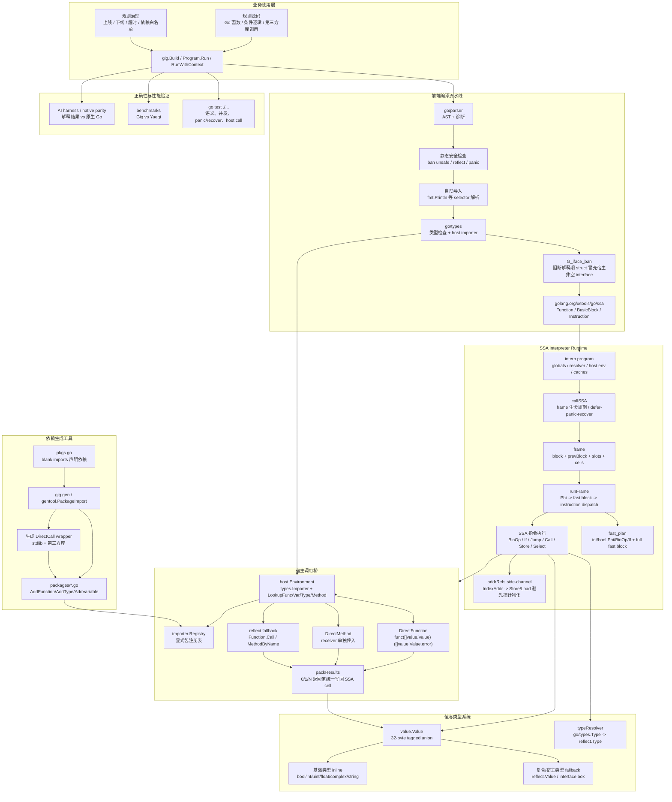
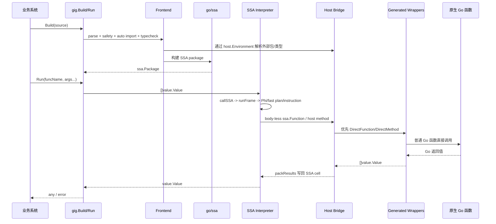

# Gig 项目总览：基于 Go SSA 的规则解释执行引擎

本文面向项目介绍、技术分享和简历材料，概括 Gig 当前架构、核心创新点、性能结论和可直接使用的简历表述。

## 项目定位

Gig 是一个可嵌入 Go 应用的动态规则解释执行引擎。它面向活动平台、配置化策略、实验规则、准入条件等“业务变化快、硬编码发布慢、模板函数扩展成本高”的场景，让规则仍然以 Go 语法编写，同时由宿主系统统一治理依赖、超时、安全边界、测试和发布下线流程。

当前实现已经从早期“SSA -> 字节码 -> 栈式 VM”演进为更直接的 SSA interpreter：

```text
Go Source -> go/parser -> go/types -> go/ssa -> direct SSA interpreter
```

这样减少一层自定义 IR/bytecode 维护成本，同时继续保留针对热点路径的 typed fast plan、frame slot、DirectCall wrapper 等性能优化。

## 详细架构图



## 执行数据流



## 核心创新点

1. **用 Go 官方前端保留开发体验，而不是自造 DSL。** 规则作者写 Go 函数，Gig 复用 `go/parser`、`go/types`、`go/ssa` 获取语法、类型和控制流语义，避免表达式 DSL 后续不断补语法、补类型系统。

2. **直接解释 SSA，降低自定义 VM 维护面。** 早期栈式 VM 已验证执行模型，但当前实现删除了自定义 bytecode/opcode 层，直接以 `ssa.BasicBlock` 和 `ssa.Instruction` 为执行对象；复杂 Go 语义如 Phi、闭包、defer/panic/recover、goroutine/channel/select 更贴近官方 IR。

3. **在“语义完整”和“热点性能”之间分层。** 通用路径保持 `value.Value` + reflect fallback，保证复合类型和宿主边界可表达；热点路径通过 frame slot、typed fast plan、`[]int` native path、IndexAddr side-channel 减少 map lookup、Cell 分配和 reflect pointer 物化。

4. **生成式 DirectCall 覆盖外部调用。** `gentool` 为标准库和第三方库生成 `func([]value.Value) ([]value.Value,error)` wrapper，支持 0/1/N 返回值和 variadic 拆包，解释器优先走 DirectFunction/DirectMethod，缺失时才回退到 reflect。当前内置 `stdlib/packages` 的 package-level functions 已全部生成 DirectCall。

5. **宿主接口边界前置治理。** 对“解释期 struct 传给宿主非空 interface”这种需要动态合成 Go 类型的高风险场景，Gig 在前端用 G_iface_ban 给出确定性错误，而不是运行期隐式失败或不完整模拟。

6. **AI harness 驱动语义回归。** 测试体系把解释执行结果与原生 Go 执行结果对比，用来验证 AI 生成代码、解释器语义和外部包桥接的一致性，降低规则引擎演进中的回归风险。

7. **从业务治理闭环出发设计。** 规则不是“能跑代码”即可，还需要依赖声明、超时取消、panic 策略、安全导入、发布下线、回归验证和性能可观测；这些能力被放在 `gig.Build`、`RunWithContext`、registry、gentool 和测试链路中统一管理。

## 最新性能快照

环境：Apple M3 Pro，Go `1.26.3`，`benchmarks` 子模块，`go test -bench '^Benchmark(Gig|Yaegi)_' -benchmem -count=5 -run '^$'`。

| Benchmark | Gig | Yaegi | 胜出 | 倍率 |
| --- | ---: | ---: | --- | ---: |
| `Fib25` | 57.88 ms | 53.74 ms | Yaegi | 1.08x |
| `ArithSum` | 40.0 us | 23.8 us | Yaegi | 1.68x |
| `BubbleSort` | 644.0 us | 676.9 us | Gig | 1.05x |
| `Sieve` | 161.5 us | 114.6 us | Yaegi | 1.41x |
| `ClosureCalls` | 445.6 us | 446.7 us | Gig | 1.00x |
| `ExtCallDirectCall` | 673.6 us | 754.3 us | Gig | 1.12x |
| `ExtCallReflect` | 372.2 us | 444.7 us | Gig | 1.19x |
| `ExtCallMethod` | 407.9 us | 558.6 us | Gig | 1.37x |
| `ExtCallMixed` | 327.8 us | 386.1 us | Gig | 1.18x |

结论：Gig 当前在外部调用相关场景全部快于 Yaegi，在纯算术微循环上仍落后；这是当前优化方向的边界，即外部包桥接和复合语义场景已经具备优势，下一阶段瓶颈主要在高频 SSA dispatch 和 typed slot/accessor。

## 简历更新建议

### 推荐标题

`Gig - 基于 Go SSA 的动态规则解释执行引擎 | Go / SSA / Interpreter / DirectCall / 规则引擎 / GitHub`

不建议继续把当前版本主标题写成“基于栈式 VM”。如果要体现演进过程，可以在面试时说明：早期版本采用栈式 VM，后续重构为直接 SSA interpreter，降低自定义 bytecode 维护成本并提升 Go 语义覆盖。

### 推荐 bullets

- 主导设计并落地兼容 Go 语法的动态规则解释执行引擎，面向活动平台规则高频变更、外部条件接入成本高的问题，以 `go/parser`、`go/types`、`go/ssa` 构建规则编译链路，替代硬编码和模板函数扩展模式，统一规则接入、发布、下线与超时治理。
- 设计直接 SSA interpreter 执行模型，覆盖控制流、闭包、多返回值、defer/panic/recover、goroutine/channel/select、宿主方法调用等 Go 语义；通过 32 字节 tagged-union `Value`、frame slot、typed fast plan、`IndexAddr` side-channel 和保守 frame pool 降低解释器分配与 dispatch 成本。
- 实现标准库与第三方 Go 包的生成式接入工具 `gig gen`，自动生成包注册代码和 DirectCall wrapper，支持多返回值与 variadic 参数拆包，使外部函数/方法调用优先绕过 `reflect.Value.Call`，在外部调用 benchmark 中整体快于 Yaegi。
- 构建可治理的宿主边界与安全模型：显式 registry 管理外部依赖，默认禁止 `unsafe`、`reflect`、`panic`，通过 G_iface_ban 阻断解释期类型冒充宿主非空 interface，并支持 `context.Context` 取消以满足在线规则执行的超时控制。
- 构建基于 go:embed/AI harness 的语义回归流程，自动对比解释执行结果与原生 Go 执行结果，覆盖 AI 生成规则、外部包调用和解释器核心语义，降低规则引擎迭代中的回归风险。
- 项目已接入活动平台约 10 个活动条件，将外部条件接入周期由数天缩短至约 30 分钟；当前 benchmark 中外部函数、方法和混合调用场景均快于 Yaegi，验证了“Go 语法 + 可控解释执行 + 生成式宿主桥”的工程可行性。

### 更短版本

- 主导实现基于 Go SSA 的动态规则解释执行引擎，复用 Go 官方 parser/typechecker/SSA 保留 Go 开发体验，替代硬编码规则和模板函数扩展模式，将活动条件接入周期由数天缩短至约 30 分钟。
- 设计直接 SSA interpreter、typed Value、frame slot/fast plan、DirectCall host bridge 等核心机制，支持控制流、闭包、多返回值、panic/recover、goroutine/channel/select 和第三方库调用。
- 实现 `gig gen` 生成式外部包接入，自动生成标准库/第三方库注册代码与 DirectCall wrapper，外部函数/方法调用场景整体性能优于 Yaegi。
- 建立 AI harness/native parity 测试流程，自动对比解释执行与原生 Go 结果，保障 AI 生成规则和解释器语义一致性。
