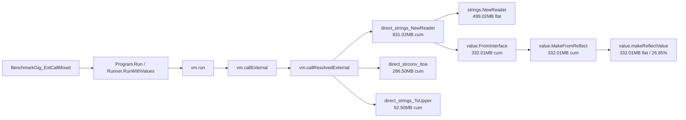
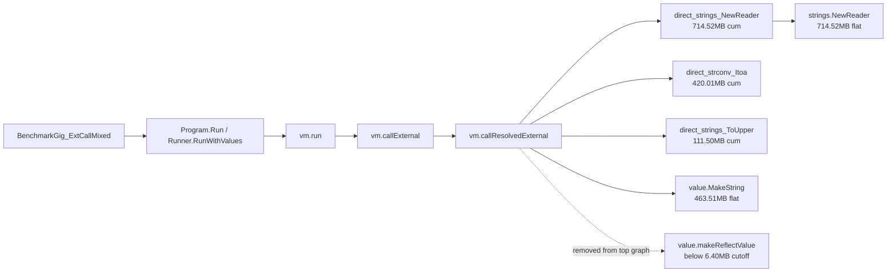

# KindExternal pprof Report

Date: 2026-06-11  
Machine: Apple M3 Pro, darwin/arm64  
Branch: `codex/value-external-kind`  
Benchmark: `BenchmarkGig_ExtCallMixed`

## Scope

This report compares Gig after the previous external-call stack-slice optimization, but before `KindExternal`, against the new `KindExternal` implementation.

The comparison is intentionally not against the older pre-stack-slice baseline. The goal here is to isolate the effect of storing external Go pointer objects as raw host objects instead of eagerly boxing them as `reflect.Value`.

Profiles used:

| Profile | Meaning |
| --- | --- |
| `/private/tmp/gig-extcallmixed-after.cpu` | Before `KindExternal`, CPU profile |
| `/private/tmp/gig-extcallmixed-after.mem` | Before `KindExternal`, memory alloc profile |
| `/private/tmp/gig-extcallmixed-kindexternal.cpu` | After `KindExternal`, CPU profile |
| `/private/tmp/gig-extcallmixed-kindexternal.mem` | After `KindExternal`, memory alloc profile |

Generated pprof graph SVGs:

| Graph | File |
| --- | --- |
| Before allocation graph | `docs/pprof/gig-extcallmixed-before-kindexternal-alloc.svg` |
| After allocation graph | `docs/pprof/gig-extcallmixed-after-kindexternal-alloc.svg` |
| Before CPU graph | `docs/pprof/gig-extcallmixed-before-kindexternal-cpu.svg` |
| After CPU graph | `docs/pprof/gig-extcallmixed-after-kindexternal-cpu.svg` |

## Executive Summary

`KindExternal` removes the per-result `reflect.Value` boxing for external pointer objects returned through DirectCall wrappers.

The important graph difference is:

```text
before:
direct_strings_NewReader
  -> value.FromInterface
    -> value.MakeFromReflect
      -> value.makeReflectValue

after:
direct_strings_NewReader
  -> strings.NewReader

value.makeReflectValue is no longer a top allocation node.
```

Benchmark impact:

| Metric | Before | After | Change |
| --- | ---: | ---: | ---: |
| `ns/op` avg | `114147.8` | `100053.4` | `-12.35%` |
| `B/op` avg | `40529.2` | `28526.2` | `-29.62%` |
| `allocs/op` | `2082` | `1582` | `-24.02%` |

The allocation drop is exactly `500 allocs/op`. The bytes drop is about `12003 B/op`, or about `24 B` per removed allocation. That lines up with removing one small reflected object box per external object return in this benchmark.

## Code Change Summary

Files changed for this optimization:

| File | Change |
| --- | --- |
| `model/value/kind.go` | Added `KindExternal` |
| `model/value/constructor.go` | Added `MakeExternal(any)` |
| `model/value/reflect.go` | `FromInterface` now stores pointer-like host objects as `KindExternal` |
| `model/value/accessor.go` | `Interface()` returns raw `obj` for `KindExternal` |
| `model/value/reflect_convert.go` | `ReflectValue()` lazily returns `reflect.ValueOf(obj)` for `KindExternal` |
| `model/value/value.go` | `IsNil()` handles typed nil external pointers |
| `model/value/comparison.go` | Pointer equality works across `KindExternal` and reflect-wrapped interface payloads |
| `model/value/container_elem.go` | `Elem`/`SetElem` use lazy `ReflectValue()` fallback |
| `vm/reference.go` | Dereference path treats `KindExternal` pointer values like reflect pointers |

The implementation is intentionally narrow: non-pointer composites such as slices, maps, channels, and structs still use existing reflect-backed behavior unless they already have native fast paths.

## Benchmark Data

Command:

```bash
cd benchmarks
go test -run '^$' -bench '^BenchmarkGig_ExtCallMixed$' -benchmem -benchtime=3s -count=5
```

Before `KindExternal`:

```text
116586 ns/op   40540 B/op   2082 allocs/op
113515 ns/op   40526 B/op   2082 allocs/op
113633 ns/op   40526 B/op   2082 allocs/op
114045 ns/op   40521 B/op   2082 allocs/op
112960 ns/op   40533 B/op   2082 allocs/op
```

After `KindExternal`:

```text
102700 ns/op   28534 B/op   1582 allocs/op
 99345 ns/op   28525 B/op   1582 allocs/op
 99643 ns/op   28526 B/op   1582 allocs/op
 99696 ns/op   28527 B/op   1582 allocs/op
 98883 ns/op   28519 B/op   1582 allocs/op
```

Interpretation:

- The main win is allocation removal, not a new VM dispatch model.
- `500 allocs/op` disappeared, which is the strongest signal that the old `reflect.Value` boxing path was removed from the hot external-object return path.
- CPU time improved because less allocation and less reflect conversion also reduce GC/runtime work.

## Allocation Graph Difference

`alloc_space` means total allocated bytes sampled during the profile, not live memory. Absolute MB values across two profiles are not as reliable as `B/op`, because each profile may run a different number of iterations. The graph shape and top nodes are still useful.

### Before `KindExternal`

`go tool pprof -top -sample_index=alloc_space /private/tmp/gig-extcallmixed-after.mem`

```text
File: gig-benchmarks.test
Type: alloc_space
Time: 2026-06-11 15:32:15 CST
Showing nodes accounting for 1215.03MB, 98.27% of 1236.45MB total

flat      flat%   cum       symbol
499.02MB  40.36% 499.02MB  strings.NewReader
343.51MB  27.78% 343.51MB  value.MakeString
332.01MB  26.85% 332.01MB  value.makeReflectValue
35.50MB    2.87%  35.50MB  internal/strconv.FormatInt
```

Simplified pprof graph:



This graph says the old path paid two costs for `strings.NewReader`:

1. The real allocation for `*strings.Reader`.
2. An additional `reflect.Value` box via `value.FromInterface -> MakeFromReflect -> makeReflectValue`.

The second cost is Gig overhead.

### After `KindExternal`

`go tool pprof -top -sample_index=alloc_space /private/tmp/gig-extcallmixed-kindexternal.mem`

```text
File: gig-benchmarks.test
Type: alloc_space
Time: 2026-06-11 18:04:52 CST
Showing nodes accounting for 1260.03MB, 98.41% of 1280.35MB total

flat      flat%   cum       symbol
714.52MB  55.81% 714.52MB  strings.NewReader
463.51MB  36.20% 463.51MB  value.MakeString
68.00MB    5.31%  68.00MB  internal/strconv.FormatInt
7.50MB     0.59%   7.50MB  context.(*cancelCtx).Done
```

Simplified pprof graph:



Important reading:

- `value.makeReflectValue` disappeared from the visible top allocation graph.
- `strings.NewReader` and `value.MakeString` take a larger percentage of the graph because one large Gig-overhead node was removed.
- The larger absolute MB for `strings.NewReader` in this specific after profile does not mean it got worse. The benchmark `B/op` is the reliable normalized allocation metric, and it improved by `29.62%`.

## CPU Graph Difference

### Before `KindExternal`

`go tool pprof -top /private/tmp/gig-extcallmixed-after.cpu`

```text
File: gig-benchmarks.test
Type: cpu
Time: 2026-06-11 15:32:12 CST
Total samples = 3.49s

flat   flat%   cum    cum%    symbol
0.75s  21.49%  2.30s  65.90%  vm.(*vm).run
0.08s   2.29%  1.18s  33.81%  vm.(*vm).callResolvedExternal
0.05s   1.43%  1.40s  40.11%  vm.(*vm).callExternal
0.00s   0.00%  0.37s  10.60%  value.FromInterface
0.03s   0.86%  0.26s   7.45%  value.MakeFromReflect
0.00s   0.00%  0.21s   6.02%  value.makeReflectValue
```

### After `KindExternal`

`go tool pprof -top /private/tmp/gig-extcallmixed-kindexternal.cpu`

```text
File: gig-benchmarks.test
Type: cpu
Time: 2026-06-11 18:04:47 CST
Total samples = 4.46s

flat   flat%   cum    cum%    symbol
1.15s  25.78%  2.48s  55.61%  vm.(*vm).run
0.11s   2.47%  0.90s  20.18%  vm.(*vm).callResolvedExternal
0.08s   1.79%  1.14s  25.56%  vm.(*vm).callExternal
0.00s   0.00%  0.11s   2.47%  value.FromInterface
```

CPU path changes:

| Symbol | Before cum% | After cum% | Reading |
| --- | ---: | ---: | --- |
| `vm.callExternal` | `40.11%` | `25.56%` | External boundary became cheaper |
| `vm.callResolvedExternal` | `33.81%` | `20.18%` | DirectCall return wrapping cost dropped |
| `value.FromInterface` | `10.60%` | `2.47%` | Less conversion work |
| `value.MakeFromReflect` | `7.45%` | not top | Removed from hot external-object return path |
| `value.makeReflectValue` | `6.02%` | not top | Removed from hot external-object return path |
| `vm.run` flat | `21.49%` | `25.78%` | VM dispatch is now a larger share of the remaining cost |

The `vm.run` flat percentage increasing is expected. It does not mean the VM got slower; it means the removed reflect/alloc overhead no longer consumes as much of the sample budget, so interpreter dispatch is more visible.

## What the pprof Graph Proves

The old graph had a Gig-specific allocation branch under `direct_strings_NewReader`:

```text
value.FromInterface -> value.MakeFromReflect -> value.makeReflectValue
```

That branch was not the actual work of `strings.NewReader`. It was Gig converting the returned `*strings.Reader` into a `reflect.Value`.

The new graph removes that branch. The returned object is now stored as:

```text
Value{kind: KindExternal, obj: *strings.Reader}
```

DirectCall wrappers that do this:

```go
recv := args[0].Interface().(*strings.Reader)
```

now get the raw pointer directly. If a slow path later needs reflection, `ReflectValue()` lazily does:

```go
reflect.ValueOf(v.obj)
```

That preserves compatibility for generic field/method/interface paths without paying the reflect cost on every direct external return.

## Remaining Bottlenecks

After this optimization, the visible allocation graph is mostly real benchmark work:

| Remaining node | Meaning |
| --- | --- |
| `strings.NewReader` | The benchmark creates reader objects; this is the external library's own allocation |
| `value.MakeString` | Gig string value creation from results like `Itoa`/`ToUpper` |
| `strconv.FormatInt` | Workload cost from `strconv.Itoa` |
| `context.(*cancelCtx).Done` / `WithDeadlineCause` | Context checking overhead around runner execution |

The next obvious targets are not `reflect.Value` boxing anymore:

1. Reduce string allocation churn when external functions return strings repeatedly.
2. Reduce context check frequency or make `checkCtx` cheaper in hot loops.
3. Consider specialized direct wrappers for common external string operations if their return values immediately feed another call.
4. Continue pushing native representations for high-frequency external return types, but only where Go semantics are easy to preserve.

## How to Inspect the Profiles

Interactive pprof:

```bash
go tool pprof -http=:8080 /private/tmp/gig-extcallmixed-after.cpu
go tool pprof -http=:8081 /private/tmp/gig-extcallmixed-kindexternal.cpu

go tool pprof -http=:8082 -sample_index=alloc_space /private/tmp/gig-extcallmixed-after.mem
go tool pprof -http=:8083 -sample_index=alloc_space /private/tmp/gig-extcallmixed-kindexternal.mem
```

Text summaries:

```bash
go tool pprof -top /private/tmp/gig-extcallmixed-after.cpu
go tool pprof -top /private/tmp/gig-extcallmixed-kindexternal.cpu

go tool pprof -top -sample_index=alloc_space /private/tmp/gig-extcallmixed-after.mem
go tool pprof -top -sample_index=alloc_space /private/tmp/gig-extcallmixed-kindexternal.mem
```

Official SVG graph export requires Graphviz `dot`. On this machine it is available at:

```text
/opt/homebrew/bin/dot
dot - graphviz version 15.0.0 (20260523.1842)
```

These commands generated the official pprof graph SVGs:

```bash
mkdir -p docs/pprof

go tool pprof -svg -sample_index=alloc_space /private/tmp/gig-extcallmixed-after.mem \
  > docs/pprof/gig-extcallmixed-before-kindexternal-alloc.svg

go tool pprof -svg -sample_index=alloc_space /private/tmp/gig-extcallmixed-kindexternal.mem \
  > docs/pprof/gig-extcallmixed-after-kindexternal-alloc.svg

go tool pprof -svg /private/tmp/gig-extcallmixed-after.cpu \
  > docs/pprof/gig-extcallmixed-before-kindexternal-cpu.svg

go tool pprof -svg /private/tmp/gig-extcallmixed-kindexternal.cpu \
  > docs/pprof/gig-extcallmixed-after-kindexternal-cpu.svg
```

## Conclusion

`KindExternal` is a successful targeted optimization.

It removes a Gig-specific `reflect.Value` boxing branch from the external DirectCall return path. On `BenchmarkGig_ExtCallMixed` this gives:

- `12.35%` lower runtime
- `29.62%` fewer bytes allocated per operation
- `24.02%` fewer allocations per operation

The pprof graph shape changed in the expected way: `value.makeReflectValue` disappeared from the hot allocation graph, and external-call CPU share fell. The remaining hot nodes are mostly actual workload allocations and string processing, not the external-object reflection wrapper that this optimization targeted.
