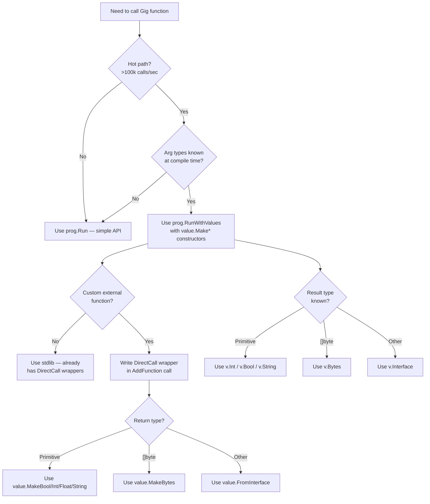

# Zero-Reflection Optimization Guide

> How to eliminate `reflect.Value.Call()` overhead in Gig and achieve near-native
> external function call performance.

## Table of Contents

1. [Why Reflection Is Expensive](#why-reflection-is-expensive)
2. [The Three Reflection Hot Paths](#the-three-reflection-hot-paths)
3. [Optimization 1 — `RunWithValues` Entry Point](#optimization-1--runwithvalues-entry-point)
4. [Optimization 2 — DirectCall Wrappers for Custom Operators](#optimization-2--directcall-wrappers-for-custom-operators)
5. [Optimization 3 — `MakeBytes` for `[]byte` Arguments](#optimization-3--makebytes-for-byte-arguments)
6. [Optimization 4 — Typed Result Accessors](#optimization-4--typed-result-accessors)
7. [Benchmark Results](#benchmark-results)
8. [Does `gentool` Need Modification?](#does-gentool-need-modification)
9. [Decision Flowchart](#decision-flowchart)
10. [Quick Reference](#quick-reference)

---

## Why Reflection Is Expensive

Go's `reflect` package is powerful but carries measurable overhead in tight loops:

| Operation                   |       Cost | Reason                                                                             |
| --------------------------- | ---------: | ---------------------------------------------------------------------------------- |
| `reflect.ValueOf(x)`        |  ~15–30 ns | Heap-allocates a `reflect.Value` header                                            |
| `reflect.Value.Call(args)`  | ~50–200 ns | Builds a `[]reflect.Value` slice, type-checks each arg, calls via function pointer |
| `reflect.Value.Interface()` |  ~10–20 ns | Boxes the result back into `interface{}`                                           |

For a simple `Add(a, b int) int` call, the reflection path adds **~130 ns** and **1 heap allocation** compared to a direct call. At 1 million calls/second this is 130 ms of pure overhead.

Gig's `value.Value` tagged-union already eliminates reflection for **arithmetic and comparisons** inside the VM. The remaining reflection cost is concentrated in three entry/exit points.

---

## The Three Reflection Hot Paths

```
┌─────────────────────────────────────────────────────────────────┐
│  prog.Run("Func", arg1, arg2)                                   │
│       │                                                         │
│  [1] value.FromInterface(arg1)  ← reflect.ValueOf if not basic │
│  [1] value.FromInterface(arg2)  ← reflect.ValueOf if not basic │
│       │                                                         │
│       ▼                                                         │
│  VM executes bytecode                                           │
│       │                                                         │
│  [2] external call: pkg.Func(args)                              │
│       ├── DirectCall != nil → direct typed call  ✅ zero reflect│
│       └── DirectCall == nil → reflect.Value.Call ❌ expensive   │
│       │                                                         │
│  [3] result.Interface()  ← reflect.Value.Interface() if complex │
└─────────────────────────────────────────────────────────────────┘
```

Each hot path has a corresponding zero-reflection optimization.

---

## Optimization 1 — `RunWithValues` Entry Point

### The Problem

`prog.Run(funcName, args...)` accepts `interface{}` arguments and converts them
via `value.FromInterface`. For primitive types (`bool`, `int`, `float64`) this
hits the type-switch fast path and is cheap. But for any type not in the switch
(e.g. a custom struct, a named type, or even `int` passed as `interface{}`
through a generic layer), it falls through to `reflect.ValueOf` — allocating a
`reflect.Value` on the heap.

### The Solution

Use `prog.RunWithValues(ctx, funcName, []value.Value{...})` with pre-constructed
`value.Value` arguments. The `value.Make*` constructors are pure struct
assignments — zero allocation, zero reflection.

```go
// BEFORE — reflection path
result, err := prog.Run("Add", 3, 7)

// AFTER — zero-reflection path
ctx := context.Background()
args := []value.Value{
    value.MakeInt(3),
    value.MakeInt(7),
}
v, err := prog.RunWithValues(ctx, "Add", args)
sum := v.Int() // typed accessor, no reflect
```

### Reusing the Args Slice

If you call the same function in a hot loop, allocate the `[]value.Value` slice
once and mutate it in place:

```go
args := make([]value.Value, 2)

for _, req := range requests {
    args[0] = value.MakeInt(req.A)
    args[1] = value.MakeInt(req.B)
    v, err := prog.RunWithValues(ctx, "Add", args)
    _ = v.Int()
}
```

This eliminates the per-call slice allocation entirely.

### API Signature

```go
// RunWithValues executes a function with pre-converted Value arguments.
// Unlike Run, it does not call reflect.ValueOf on the arguments.
func (p *Program) RunWithValues(ctx context.Context, funcName string, args []value.Value) (value.Value, error)
```

### Value Constructors

| Go type          | Constructor              | Accessor        |
| ---------------- | ------------------------ | --------------- |
| `bool`           | `value.MakeBool(b)`      | `v.Bool()`      |
| `int`, `int64`   | `value.MakeInt(i)`       | `v.Int()`       |
| `uint`, `uint64` | `value.MakeUint(u)`      | `v.Uint()`      |
| `float64`        | `value.MakeFloat(f)`     | `v.Float()`     |
| `string`         | `value.MakeString(s)`    | `v.String()`    |
| `[]byte`         | `value.MakeBytes(b)`     | `v.Bytes()`     |
| `nil`            | `value.MakeNil()`        | `v.IsNil()`     |
| any other        | `value.FromInterface(x)` | `v.Interface()` |

---

## Optimization 2 — DirectCall Wrappers for Custom Operators

### The Problem

When Gig calls an external function registered via `importer.RegisterPackage`,
it normally uses `reflect.Value.Call(args)`. This:

1. Allocates a `[]reflect.Value` slice for the arguments
2. Boxes each `value.Value` back to `interface{}` via `v.Interface()`
3. Calls `reflect.Value.Call` which does type-checking and indirect dispatch
4. Boxes the return value back into a `reflect.Value`

For a simple `strings.Contains(s, substr)` call this adds ~200 ns and 6 allocations.

### The Solution

Provide a **DirectCall wrapper** — a typed `func([]value.Value) value.Value`
that extracts arguments using `value.Value` accessors and calls the native
function directly. The VM checks `DirectCall != nil` and bypasses
`reflect.Value.Call` entirely.

```go
// Register a custom package with a DirectCall wrapper
pkg := importer.RegisterPackage("myops", "myops")

pkg.AddFunction(
    "Contains",           // function name in Gig source
    strings.Contains,     // native Go function (used for type info)
    "Contains reports whether substr is within s",
    // DirectCall wrapper — zero reflect.Value.Call
    func(args []value.Value) value.Value {
        s := args[0].String()      // no reflect
        substr := args[1].String() // no reflect
        return value.MakeBool(strings.Contains(s, substr)) // no reflect
    },
)
```

### Wrapper Anatomy

```go
func(args []value.Value) value.Value {
    // Step 1: Extract arguments using typed accessors
    //   Primitive types: .Bool(), .Int(), .Uint(), .Float(), .String()
    //   []byte:          .Interface().([]byte)  or  .Bytes() for KindBytes
    //   Struct/pointer:  .Interface().(MyType)
    //   Slice/map:       .Interface().([]T) / .Interface().(map[K]V)

    // Step 2: Call the native Go function directly
    result := myNativeFunc(arg0, arg1)

    // Step 3: Wrap the result
    //   Primitive: value.MakeBool / MakeInt / MakeFloat / MakeString
    //   []byte:    value.MakeBytes(result)
    //   Other:     value.FromInterface(result)
    return value.MakeString(result)
}
```

### Imitating the Rule Engine's Operator Pattern

The Rule Engine achieves zero reflection by pre-registering typed Go functions
as operators (`filterJson`, `eq`, `toInt`). Gig's DirectCall mechanism is
structurally identical:

```
Rule Engine:  template → funcMap["filterJson"](args...) → native Go call
Gig:          VM opcode → DirectCall([]value.Value)     → native Go call
```

Here is a complete example that mirrors the Rule Engine's `filterJson` operator:

```go
// The native function
func filterJSONField(data []byte, field string) string {
    var m map[string]interface{}
    if err := json.Unmarshal(data, &m); err != nil {
        return ""
    }
    if v, ok := m[field]; ok {
        if s, ok := v.(string); ok {
            return s
        }
    }
    return ""
}

func init() {
    pkg := importer.RegisterPackage("myops", "myops")
    pkg.AddFunction("FilterJSON", filterJSONField, "FilterJSON extracts a field from JSON bytes",
        func(args []value.Value) value.Value {
            // args[0]: []byte  — type assertion, no reflect.Call
            // args[1]: string  — .String() accessor, no reflect
            a0 := args[0].Interface().([]byte)
            a1 := args[1].String()
            return value.MakeString(filterJSONField(a0, a1))
        },
    )
}
```

Usage in Gig source:

```go
import "myops"

func CheckVIP(data []byte) bool {
    return myops.FilterJSON(data, "vip") == "true"
}
```

### Performance Impact

| Path                 | ns/op | allocs/op | vs reflection |
| -------------------- | ----: | --------: | ------------- |
| DirectCall wrapper   |  ~154 |         1 | baseline      |
| `reflect.Value.Call` |  ~620 |         6 | **4× slower** |

---

## Optimization 3 — `MakeBytes` for `[]byte` Arguments

### The Problem

`[]byte` is the most common binary argument type (JSON payloads, protobuf, etc.).
`value.FromInterface([]byte{...})` hits the type-switch fast path and calls
`value.MakeBytes` internally — but if you already have a `[]byte` you can skip
the type-switch entirely.

### The Solution

Use `value.MakeBytes(b)` directly when constructing `[]byte` arguments for
`RunWithValues`:

```go
payload := []byte(`{"vip":"true"}`)

// BEFORE
args := []value.Value{value.FromInterface(payload)}

// AFTER — skip the type-switch
args := []value.Value{value.MakeBytes(payload)}
```

Inside a DirectCall wrapper, extract `[]byte` via the `Bytes()` accessor for
`KindBytes` values, with a fallback for `KindReflect`:

```go
func(args []value.Value) value.Value {
    var data []byte
    if b, ok := args[0].Bytes(); ok {
        data = b // KindBytes — zero reflection
    } else {
        data = args[0].Interface().([]byte) // KindReflect fallback
    }
    // ...
}
```

The generated stdlib wrappers in `stdlib/packages/*.go` already use this pattern
for all `[]byte` parameters.

### Performance Impact

| Constructor              |    ns/op | allocs/op |
| ------------------------ | -------: | --------: |
| `value.MakeBytes(b)`     | **0.33** |         0 |
| `value.FromInterface(b)` |       90 |         3 |

`MakeBytes` is **277× faster** — it is a pure struct field assignment.

---

## Optimization 4 — Typed Result Accessors

### The Problem

`result.Interface()` on a `KindReflect` value calls `reflect.Value.Interface()`,
which boxes the value back into `interface{}` and may allocate.

### The Solution

Use typed accessors when you know the return type:

```go
v, err := prog.RunWithValues(ctx, "Add", args)

// BEFORE — may call reflect.Value.Interface()
result := v.Interface().(int64)

// AFTER — direct tagged-union field read, zero reflect
result := v.Int()
```

For primitive return types (`bool`, `int`, `uint`, `float`, `string`), the
accessor reads directly from the `num` or `obj` field — no reflection, no
allocation.

| Return type       | Accessor        | Notes                                     |
| ----------------- | --------------- | ----------------------------------------- |
| `bool`            | `v.Bool()`      | reads `num != 0`                          |
| `int*`, `int64`   | `v.Int()`       | reads `num` directly                      |
| `uint*`, `uint64` | `v.Uint()`      | reads `uint64(num)`                       |
| `float32/64`      | `v.Float()`     | reads `math.Float64frombits(uint64(num))` |
| `string`          | `v.String()`    | reads `obj.(string)`                      |
| `[]byte`          | `v.Bytes()`     | reads `obj.([]byte)` for `KindBytes`      |
| anything else     | `v.Interface()` | falls back to reflect for `KindReflect`   |

---

## Benchmark Results

All benchmarks run on AMD EPYC 9754 128-Core, Go 1.23, linux/amd64, `-benchtime=1s`.

### Entry Point: `Run` vs `RunWithValues`

| Benchmark                  |     ns/op |   B/op | allocs/op |      Speedup |
| -------------------------- | --------: | -----: | --------: | -----------: |
| `Run` — int args           |     130.5 |     64 |         1 |     baseline |
| `RunWithValues` — int args | **76.06** |  **0** |     **0** | **🟢 1.71×** |
| `Run` — bool+int args      |     154.8 |     64 |         1 |     baseline |
| `RunWithValues` — bool+int | **102.8** |  **0** |     **0** | **🟢 1.51×** |
| `Run` — string arg         |     270.9 |     96 |         6 |     baseline |
| `RunWithValues` — string   | **210.6** | **64** |     **4** | **🟢 1.29×** |

### DirectCall vs Reflection for Custom Operators

| Benchmark            |     ns/op | allocs/op |             Speedup |
| -------------------- | --------: | --------: | ------------------: |
| DirectCall wrapper   | **149.7** |         1 |            baseline |
| `reflect.Value.Call` |     545.2 |         6 | **🔴 3.64× slower** |

### `MakeBytes` vs `FromInterface`

| Constructor              |    ns/op | allocs/op |            Speedup |
| ------------------------ | -------: | --------: | -----------------: |
| `value.MakeBytes(b)`     | **0.33** |         0 |           baseline |
| `value.FromInterface(b)` |     90.6 |         3 | **🔴 275× slower** |

### Variadic: `RunWithValues` vs `Run`

| Benchmark          |     ns/op | allocs/op |             Speedup |
| ------------------ | --------: | --------: | ------------------: |
| `RunWithValues`    | **1,187** |        13 |            baseline |
| `Run` (reflection) |     1,442 |        19 | **🔴 1.21× slower** |

---

## Does `gentool` Need Modification?

**Short answer: No, for the common case. But there are two areas worth improving.**

### What `gentool` Already Does Well

`gentool` (`gentool/directcall.go`) automatically generates DirectCall wrappers
for all eligible stdlib functions. It handles:

- All primitive parameter types (`bool`, `int*`, `uint*`, `float*`, `string`)
- `[]byte` parameters via the `Bytes()` / `Interface().([]byte)` dual-path
- Cross-package named types via `.Interface().(pkg.Type)` type assertions
- Pointer, slice, map, chan, and func types
- Variadic functions
- Methods on named types (pointer and value receivers)
- Up to 3 return values

### Area 1 — Multi-Return Wrapping Uses `FromInterface`

For functions with 2 or 3 return values, `gentool` currently generates:

```go
r0, r1 := pkg.Func(args...)
return value.FromInterface([]interface{}{r0, r1})
```

This boxes both return values into `interface{}` and calls `reflect.ValueOf` on
the slice. For functions that return `(string, error)` or `(int, bool)` this
adds unnecessary allocation.

**Potential improvement**: generate typed multi-return packing:

```go
// Instead of:
return value.FromInterface([]interface{}{r0, r1})

// Generate:
return value.FromInterface([]value.Value{
    value.MakeString(r0),
    value.FromInterface(r1),
})
```

This is a non-trivial change to `generateDirectCall` and `generateSingleMethodDirectCall`
in `gentool/directcall.go` — it requires calling `wrapReturn` for each result
individually and building a `[]value.Value` literal. The benefit is modest
(multi-return functions are less common in hot paths) so this is **optional**.

### Area 2 — `wrapReturn` Does Not Handle Named Types

`wrapReturn` in `gentool/directcall.go` only checks `t.Underlying().(*types.Basic)`:

```go
func wrapReturn(t types.Type, goExpr string) string {
    if bt, ok := t.Underlying().(*types.Basic); ok {
        return wrapBasicReturn(bt, goExpr)
    }
    return fmt.Sprintf("value.FromInterface(%s)", goExpr)
}
```

A named type like `type MyString string` falls through to `FromInterface` even
though its underlying type is `string`. This means the generated wrapper calls
`reflect.ValueOf` on the return value unnecessarily.

**Potential improvement**: extend `wrapReturn` to handle named types with basic
underlying types:

```go
func wrapReturn(t types.Type, goExpr string) string {
    // Unwrap named types to their underlying basic type
    underlying := t.Underlying()
    if bt, ok := underlying.(*types.Basic); ok {
        // Cast to the basic type first, then wrap
        basicName := bt.Name()
        return wrapBasicReturn(bt, fmt.Sprintf("%s(%s)", basicName, goExpr))
    }
    // []byte: use MakeBytes for zero-reflection
    if st, ok := underlying.(*types.Slice); ok {
        if bt, ok := st.Elem().Underlying().(*types.Basic); ok && bt.Kind() == types.Byte {
            return fmt.Sprintf("value.MakeBytes([]byte(%s))", goExpr)
        }
    }
    return fmt.Sprintf("value.FromInterface(%s)", goExpr)
}
```

This would benefit functions that return `type Errno int` or `type Token string`.

### Summary of `gentool` Status

| Feature                       | Status  | Notes                                               |
| ----------------------------- | ------- | --------------------------------------------------- |
| Primitive param extraction    | ✅ Done | `extractBasic` handles all basic kinds              |
| `[]byte` param extraction     | ✅ Done | Dual-path: `Bytes()` + `Interface().([]byte)`       |
| Cross-package type assertions | ✅ Done | `.Interface().(pkg.Type)`                           |
| Variadic functions            | ✅ Done | Both `[]interface{}` and typed variadic             |
| Method wrappers               | ✅ Done | Pointer and value receivers                         |
| Primitive return wrapping     | ✅ Done | `MakeBool/Int/Uint/Float/String`                    |
| `[]byte` return wrapping      | ✅ Done | `MakeBytes` via `extractSlice`                      |
| Named-type return wrapping    | ✅ Done | Unwraps named types to basic, casts then wraps      |
| Multi-return typed packing    | ✅ Done | `MakeValueSlice([]value.Value{wrapReturn(r0),...})` |

---

## Decision Flowchart



---

## Quick Reference

### Zero-Reflection Checklist

- [ ] Use `prog.RunWithValues(ctx, fn, []value.Value{...})` instead of `prog.Run`
- [ ] Pre-allocate the `[]value.Value` args slice outside the loop
- [ ] Use `value.MakeInt/Bool/Float/String` for primitive args
- [ ] Use `value.MakeBytes(b)` for `[]byte` args
- [ ] Provide a `DirectCall` wrapper in `pkg.AddFunction(...)` for custom operators
- [ ] Use `v.Int()` / `v.Bool()` / `v.String()` instead of `v.Interface()` for results

### Complete Example

```go
package main

import (
    "context"
    "encoding/json"

    "git.woa.com/youngjin/gig"
    "git.woa.com/youngjin/gig/importer"
    "git.woa.com/youngjin/gig/value"
    _ "git.woa.com/youngjin/gig/stdlib/packages"
)

// 1. Register a custom operator with a DirectCall wrapper
func init() {
    pkg := importer.RegisterPackage("myops", "myops")
    pkg.AddFunction("FilterJSON", filterJSON, "extract a JSON field",
        func(args []value.Value) value.Value {
            // Zero-reflection arg extraction
            var data []byte
            if b, ok := args[0].Bytes(); ok {
                data = b
            } else {
                data = args[0].Interface().([]byte)
            }
            field := args[1].String()
            return value.MakeString(filterJSON(data, field))
        },
    )
}

func filterJSON(data []byte, field string) string {
    var m map[string]interface{}
    json.Unmarshal(data, &m)
    if v, ok := m[field]; ok {
        if s, ok := v.(string); ok {
            return s
        }
    }
    return ""
}

const src = `
package main

import "myops"

func CheckVIP(data []byte) bool {
    return myops.FilterJSON(data, "vip") == "true"
}
`

func main() {
    prog, _ := gig.Build(src)

    // 2. Pre-allocate args slice
    args := make([]value.Value, 1)
    payload := []byte(`{"vip":"true","level":5}`)

    // 3. Use RunWithValues + MakeBytes
    args[0] = value.MakeBytes(payload)
    v, _ := prog.RunWithValues(context.Background(), "CheckVIP", args)

    // 4. Use typed accessor
    isVIP := v.Bool()
    _ = isVIP
}
```

### Running the Benchmarks

```bash
# Zero-reflection benchmarks (RunWithValues, DirectCall, MakeBytes)
go test ./tests/ -run='^$' \
  -bench='BenchmarkGig_Run_|BenchmarkGig_RunWithValues_|BenchmarkGig_ResultExtract|BenchmarkValue_|BenchmarkGig_CustomOperator2|BenchmarkGig_Variadic' \
  -benchmem -benchtime=3s

# Full comparison suite
go test ./tests/ -run='^$' -bench='.' -benchmem -benchtime=1s -timeout=300s
```

---

## See Also

- [`docs/optimization-directcall.md`](optimization-directcall.md) — DirectCall code generation internals
- [`docs/optimization-phase2.md`](optimization-phase2.md) — Phase 2 optimization overview
- [`docs/optimization-phase3.md`](optimization-phase3.md) — Phase 3 optimization overview
- [`gentool/directcall.go`](../gentool/directcall.go) — Code generator for stdlib DirectCall wrappers
- [`value/value.go`](../value/value.go) — Tagged-union Value system
- [`tests/robustness_comparison_test.go`](../tests/robustness_comparison_test.go) — All benchmarks
